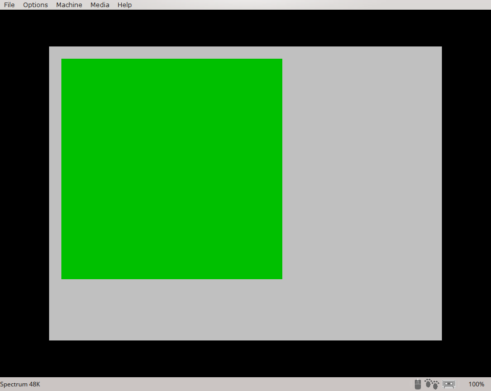
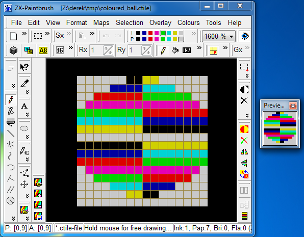

# ZX Spectrum Development with Z88DK - BiFrost

This is the sixth document in the series which describes how to get started
writing ZX Spectrum programs using Z88DK. As before, it concerns itself only
with the newer, more standards compilant zsdcc C compiler. Neither the original
sccz80 compiler nor the classic library is discussed.

This document covers the BiFrost library which provides multicolour graphics
support for Spectrum programs. Although this might be considered a rather niche
topic, the discussion also covers other aspects of Z88DK which will be referred
to in future installments. The reader is encouraged to at least skim read the
document even if they have no particular interest in BiFrost.

## Assumptions

It is assumed the reader has worked through the earlier installments of this
series and is continuing on from [installment 5](https://github.com/z88dk/z88dk/blob/master/doc/ZXSpectrumZSDCCnewlib_05_MultipleFiles.md).

If you would like to jump to the beginning, click on [installment 1](https://github.com/z88dk/z88dk/blob/master/doc/ZXSpectrumZSDCCnewlib_01_GettingStarted.md).

## Z88DK's BiFrost Library

[BiFrost](http://www.worldofspectrum.org/infoseekid.cgi?id=0027405)
is a multicolour graphics library written by
[Einar Saukas](https://www.ime.usp.br/~einar/bifrost/), which has
been embedded into, and interfaced with, the Z88DK C development
kit. "Multicolour" means it's capable of drawing blocks of pixels which are 8
pixels wide by 1 pixel high, each with 2 colour attributes. This works much the
same way as the Spectrum's native 8x8 pixel blocks which have the INK and PAPER
attributes, but since BiFrost's blocks occupy 1 pixel row instead of 8, the
programmer can get a much more colourful display.

There are 2 versions of BiFrost: the original and BiFrost2. Somewhat
confusingly, the original BiFrost also comes in 2 versions, low resolution and
high resolution. Which of the 3 versions you chose depends on what capabilities
you require.

## Understanding BiFrost's Capabilities

BiFrost places coloured _tiles_ within its display area. Although tiles can be
animated and moved around to some extent, they're not the _sprite_ type of
graphics which you might think of as floating freely around the screen. BiFrost
isn't suitable for Space Invaders, but it will help you to write puzzle games,
board games, strategy and turn playing games, and will do so providing a level
of colour which the Spectrum shouldn't really be capable of.

Technical limitations mean BiFrost can't use the whole screen. It's restricted
to 18 character rows by 18 character columns. That's 144x144 pixels, as seen in
green:



The low resolution version of BiFrost can place a 16x16 pixel multicolour "tile"
at 8 pixel boundaries, i.e. aligned to character locations. The high resolution
version of BiFrost can place a multicolour tile at any vertical pixel, although
still aligned to 8 pixel horizonal coordinates, at the expense of more memory
consumption and greater CPU processing requirement over the low resolution
version.

BiFrost2 is an improvement on the high resolution version of BiFrost. It can
place a 16x16 pixel multicolour tile at any vertical pixel, and can do so within
a 20x22 character grid. That's a 160x176 pixel area of the screen.

## A BiFrost Program BASIC Loader

BiFrost based programs created with Z88DK LOAD in a slightly different way to
most Spectrum programs. The compliation process generates _two_ blocks of
machine code. The first is the programmer's code, the compiled C, as usual. The
second is the BiFrost library itself, which is loaded separately into a
specifically allocated area of high memory. The details of why aren't really
important at this getting started level. The important thing is to understand
the loading process the Spectrum will have to go through:

* load and run a BASIC loader
* the BASIC loader loads the programmer's CODE into memory
* the BASIC loader then loads the BiFrost library CODE into higher memory
* the BASIC loader then runs the programmer's code

The programmer's code, created by Z88DK, expects to find the BiFrost library
loaded and waiting to be run at the correct address. (BiFrost  has to be loaded
at an exact memory location otherwise it won't work.) As long as the BASIC loader
has loaded BiFrost into the correct area of memory this will work as expected.

Step 1, therefore, is to create a BASIC loader program. Yes, you're going to
type a bit of Spectrum BASIC. Here it is:

```
10 CLEAR 32767
20 LOAD "" CODE
30 LOAD "" CODE
40 RANDOMIZE USR 32768
```

This needs to be saved to a .TAP file. The exact steps for doing this depend on
the emulator you're using. On Fuse you would use Media->Tape->Clear to clear the
emulator's "virtual tape", then save the program with:

```
SAVE "biloader" LINE 10
```

Once that's complete, write out the "virtual tape" to a file called
bifrost_loader.tap using Media->Tape->Write. That's the loader part completed.

## Create a ctile

A _ctile_ in BiFrost terminology is a 16x16 pixel graphic which can be thought
of as being divided into 2 columns of 8 bits each, by 16 rows high. Each of
these 8 pixel wide by 1 pixel high blocks can have two colours - like INK and
PAPER in traditional Spectrum terms.

The ctile data format is very simple: 32 bytes of bitmap data followed by 32
bytes of attribute data. Even so, a graphical editor makes life a lot easier
when designing tiles, and [ZX
Paintbrush](http://www.zx-modules.de/zxpaintbrush/zxpaintbrush.html) supports
them natively. Sadly, from a Linux user's perspective, this is a Windows-only
tool. although it does appear to run under WINE.

This author used a Windows virtual machine to run it, and stretching his
artistic abilities to the absolute limit, created the coloured ball seen below:



ZX Paintbrush saves ctiles in a 16KB file containing 256 tiles, so all your
tiles would normally be saved and loaded via a single file. For this example we
only needed a single ctile, so the 64 byte file was created using ZX
Paintbrush's export function, which will create a ctile file containing a single
ctile.

## Load the ctile into an Assembly File

There are several ways to get the 64 bytes of ctile data into a Z88DK program. A
C array containing the relevant bytes is probably easiest, but not the most
flexible since you'd have to change the array each time you update your
graphic. An alternative, which we use in this example, is to create an assembly
language file like this:

```
SECTION rodata_user

PUBLIC _ctiles

_ctiles:

   BINARY "coloured_ball.ctile"
```

Save that to a file called ctile.asm. It creates a symbol for the ctile data
called __ctiles_, the leading underscore of which exports it so it's visible to
the C program, as we'll see in a moment.

The assembler's BINARY command loads the binary data from the named file, which
is the output from ZX Paintbrush.

### A Simple BiFrost Program - Low Resolution

Step 3 is to create a small program which uses BiFrost. Save this to
bifrost_01.c:

```
#pragma output REGISTER_SP  = -1
#pragma output CLIB_MALLOC_HEAP_SIZE = 0

#include <arch/zx.h>
#include <arch/zx/bifrost_l.h>

extern unsigned char ctiles[];

int main()
{
  unsigned char blank_tile_index;
  unsigned char row, col;

  BIFROSTL_resetTileImages(_ctiles);

  for(blank_tile_index = 0; blank_tile_index < 81; blank_tile_index++) {
    BIFROSTL_tilemap[blank_tile_index] = BIFROSTL_DISABLED;
  }

  zx_cls(PAPER_WHITE);

  for(row = 1; row <=17; row++)
    for(col = 1; col <= 17; col+=2)
      BIFROSTL_fillTileAttrL(row, col, INK_WHITE+(8*INK_WHITE));

  BIFROSTL_setTile(0, 0, 0+BIFROSTL_STATIC);

  BIFROSTL_start();

  while(1); 
}
```

This C program references the external symbol _ctiles_ which is the array of
tile data the assembly language file makes available. This data is loaded into
BiFrost's tile images data area using the BIFROSTL_resetTileImages()
function. This area has enough space for 256 tiles, although in this example
only the first tile, tile 0, is used.

The BiFrost tile map is the in-memory representation of what's on the
screen. Set a value in this array and the BiFrost engine will magically render a
tile onto the screen. More specifically, the BIFROSTL_tilemap has 81 entries,
representing the 9x9 tile grid. Each entry hold the index into the tile images
data area (as set by the BIFROSTL_resetTileImages() call earlier) of the tile to
render in that screen location. So if you set BIFROSTL_tilemap[0] to 0, the
first tile in the tile images will appear in the top left corner of the BiFrost
display. Set that array entry to the value BIFROSTL_DISABLED and the tile will
disappear again. Thus you control the tiles shown onscreen by changing the
values in the BIFROSTL_tilemap array.

We start our example by reseting all the BIFROSTL_tilemap entries to
BIFROSTL_DISABLED which ensures no tiles are rendered to start with, then we set
the attributes of the display area to all white. (Note the rather unusual
looking values used in the two loops around the call to BIFROSTL_fillTileAttrL()
- this is explained in the [function's entry in the header
file](https://github.com/z88dk/z88dk/blob/master/include/_DEVELOPMENT/sdcc/arch/zx/bifrost_l.h).

We then place our single tile, the coloured ball (index 0 in our tiles image
data array), at position 0,0 which is the top left corner. With everything in
place we then fire up the BiFrost engine and go into an infinite loop. (If we
return to BASIC BiFrost stops.)

### Memory Map and the Pragmas


### Building the Program

We can compile our little program with this:

```
zcc +zx -vn -startup=31 -clib=sdcc_iy bifrost_01.c ctile.asm -o bifrost_01
```

We use crt31 since we're not using the standard IO. Also note there's no
specific mention of the BiFrost library on the compile line. For Spectrum
programs Z88DK's standard library makes BiFrost available automatically.

Once this has run you'll notice it's created two binary files in the local
directory:

```
bifrost_01_CODE.bin
bifrost_01_BIFROSTL.bin
```

The first of those is programmer's code, the second is the BiFrost
library. These files contain raw machine code, so we need to convert them into
.TAP files which the Spectrum can load via the BASIC loader we've already
created. In previous examples we've used zcc's -create-app option to do this
step, but since we're now working with multiple code files which are beyond
zcc's remit we need to do it manually. 

The command to convert a binary machine code file to a .TAP file is _appmake_
and for our first piece of code we build a command as follows.

Our target machine, as ever, be a ZX Spectrum:

```
appmake +zx ...
```

Our binary input file is bifrost_01_CODE.bin:

```
appmake +zx -b bifrost_01_CODE.bin ...
```

and the output file will be bifrost_01_code.tap:

```
appmake +zx -b bifrost_01_CODE.bin -o bifrost_01_code.tap ...
```

By default the appmake utility produces a little BASIC loader program to load
machine code. In this case we've already written our own, so we need to suppress
that:

```
appmake +zx -b bifrost_01_CODE.bin -o bifrost_01_code.tap --noloader ...
```

Next we need to specify where the piece of code will be LOADed. This value goes
into the tape header so when you type _LOAD "" CODE_ (i.e. without a specific
load address) the Spectrum can work out where in memory it's expected to load
the code. By default Z88DK compiled code expects to load and run from address
32768, so:

```
appmake +zx -b bifrost_01_CODE.bin -o bifrost_01_code.tap --noloader --org 32768 ...
```

Finally we need to provide a name for the block of CODE on the tape:

```
appmake +zx -b bifrost_01_CODE.bin -o bifrost_01_code.tap --noloader --org 32768 --blockname bifrost_01_code
```

We have to create two pieces of tape loadable code for our BiFrost project, the
second containing the BiFrost code which expects to load and run from address
58625. So the two commands to create the .TAP files are:

```
appmake +zx -b bifrost_01_CODE.bin -o bifrost_01_code.tap --noloader --org 32768 --blockname bifrost_01_code
appmake +zx -b bifrost_01_BIFROSTL.bin -o bifrostl.tap --noloader --org 58625 --blockname bifrostl
```

Finally, we need to merge our 3 tape files into a single one. The .TAP format is
a very simple one which allows direct concatenation of .TAP files in order to
make a single big one, so on Linux the command is:

```
cat bifrost_loader.tap bifrost_01_code.tap bifrostl.tap > bifrost_01.tap
```

This is all a bit fussy to keep typing, so maybe it's time for a makeifle:

```
all: bifrost_01.tap

bifrost_01_CODE.bin: bifrost_01.c ctile.asm coloured_ball.ctile
	zcc +zx -vn -startup=31 -clib=sdcc_iy bifrost_01.c ctile.asm -o bifrost_01

bifrost_01_code.tap: bifrost_01_CODE.bin
	appmake +zx -b bifrost_01_CODE.bin -o bifrost_01_code.tap --noloader --org 32768 --blockname bifrost_01_code
	appmake +zx -b bifrost_01_BIFROSTL.bin -o bifrostl.tap --noloader --org 58625 --blockname bifrostl

bifrost_01.tap: bifrost_01_code.tap
	cat bifrost_loader.tap bifrost_01_code.tap bifrostl.tap > bifrost_01.tap
```

Clearly this makefile could be made more streamlined, or more generic, but it
works for this example.

Once the loader, the C code and the BiFrost library are all loaded from tape the
Spectrum's memory will look like this:


```
+-------------+
|0xFFFF  65535|
|             | User Defined Graphics
|-------------|
|0xFF58  65368| Z88DK program's stack
|-------------| Grows downwards, remember!
|             |
|             |
|             | Z88DK heap memory
|             |
|             |
|-------------|
|             | Z88DK BSS section  (CRT_BSS_DATA)
|             | Z88DK DATA section (CRT_ORG_DATA)
|-------------| ^^^
|             |
|0x8000  32768| Z88DK compiled C   (CRT_ORG_CODE)
|-------------|
|             | Lower RAM, includes
|             | sys vars, print buffer, etc.
|             | Slower, "contended memory"
|-------------|
|0x5AFF  23295|
|             | Display File (i.e. screen memory)
|0x4000  16384|
|-------------|
|0x3FFF  16383|
|             | ROM
|0x0000      0|
+-------------+
```

### Nirvana

Two versions, Nivana and Nivana+. They only differ in the screen size and what
happens when a sprite is positioned at the edge of the screen.

Speccy has 8x8 pixel blocks with one INK/PAPER attribute used to colour
them. Nirvana uses what's termed a "bi-colour" pixel block which is 8x2 pixels
with one INK/PAPER attribute. 