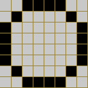
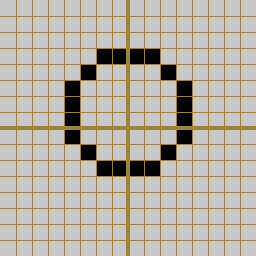

# ZX Spectrum Development with C, Z88DK and SP1 - Getting Started

This document describes how to get started writing ZX Spectrum programs using
C, Z88DK and the SP1 sprite library. 

## Assumptions

The reader is assumed to have read the Z88DK getting started guide,
which covers getting started with Z88DK and its 'C' programming
environment. A complete understanding of the details of the more
advanced topics such as BiFrost and interrupts is not required to work
with SP1, but the reader is assumed to be familiar with at least the
first 6 installments of that guide.

The tutorial for SP1's predecessor, splib2, is avaiable as a PDF
document
[here](http://www.mojontwins.com/warehouse/splib2-tutorial.pdf). It's
not essential to understand that document, and the details in this one
override the details in that older one, but splib2 does cover quite a
lot of the details and algorithms which apply to SP1. It's worth at
least skimming.

## Strategy

SP1 is one of those technologies where you need to know quite a lot of
it in order to make sense of any of it. This can make it tricky to
learn, with the danger the user gets lost chasing down endless
dependency information and rapidly losing the plot.

We shall try to avoid this scenario by deliberately skimming, and in
some cases ignoring, fine details and nuances which a beginner
shouldn't be worrying about. We're going to dive straight into code,
and the reader will need to accept that not everything will be
explained as we go.

## Program 1 - SP1 Circle Sprite

We're going to start with a program which sets up the SP1
library, creates a small (8x8 pixel) sprite, and places it on screen in
the simplest way possible. There isn't going to be a mask, and the
sprite will be loaded straight into screen memory overwriting whatever
is there. We have to start somewhere.

And we start not with C code, but assembly language. Save this listing to a
file named 'circle.asm':

```
SECTION rodata_user

PUBLIC _circle

	defb @00000000
	defb @00000000
	defb @00000000
	defb @00000000
	defb @00000000
	defb @00000000
	defb @00000000

._circle
	defb @00111100
	defb @01000010
	defb @10000001
	defb @10000001
	defb @10000001
	defb @10000001
	defb @01000010
	defb @00111100

	defb @00000000
	defb @00000000
	defb @00000000
	defb @00000000
	defb @00000000
	defb @00000000
	defb @00000000
	defb @00000000

```

This piece of assembly defines an SP1 sprite in 23 data bytes. We
could do this quite easily in C of course, given that it's only 23
static numbers, but we use assembly language for it because the
assembler allows numbers to be declared using binary notation, whereas
C doesn't. You can see the pattern of the sprite in the ones and
zeroes which makes it a little easier to look at.

The very top line of the file sets the *section* of the final program
this piece of data needs to go into. Z88DK uses sections to arrange
the final output in the Spectrum's memory. The
[details](https://www.z88dk.org/wiki/doku.php?id=temp:front#assembly_language)
aren't important at this stage, just be aware that if C code is to
use the data being specified in an assembly language file, that data
needs to be placed in the *read only user's data* section.

Next we declare the label *_circle* to be publicly visible such that
code in external files (the C source) can see it.

Then we define 7 zero bytes. This isn't, as might be expected by more
experienced readers, anything to do with a mask. As stated, this
example isn't going to use a mask. There's another reason for placing
these 7 bytes here, and we'll come to it shortly.

Then we see the 8x8 pixel sprite data, labelled as *_circle* with a
leading underscore which is how the C compiler expects to be able to
reference it. These 8 bytes define a small circle in exactly the same
manner as a traditional user defined graphic (UDG).

Finally there are another 8 zero bytes following the graphic
data. Again, we'll see what this is for in a moment.

We therefore have our sprite data, defined in assembly language. Let's
now look at some C code.

Save this listing to a file named 'circle.c':

```
#pragma output REGISTER_SP = 0xD000

#include <intrinsic.h>
#include <arch/zx.h>
#include <arch/zx/sp1.h>

extern unsigned char circle[];

int main()
{
  struct sp1_Rect full_screen = {0, 0, 32, 24};
  struct sp1_ss  *circle_sprite;

  intrinsic_ei();
  zx_border(INK_BLACK);

  sp1_Initialize( SP1_IFLAG_MAKE_ROTTBL | SP1_IFLAG_OVERWRITE_TILES | SP1_IFLAG_OVERWRITE_DFILE,
                  INK_BLACK | PAPER_WHITE,
                  ' ' );
  sp1_Invalidate(&full_screen);
 
  circle_sprite = sp1_CreateSpr(SP1_DRAW_LOAD1LB, SP1_TYPE_1BYTE, 2, (int)circle, 0);

  sp1_AddColSpr(circle_sprite, SP1_DRAW_LOAD1RB, SP1_TYPE_1BYTE, (int)circle, 0);

  sp1_MoveSprAbs(circle_sprite, &full_screen, 0, 0, 0, 0, 0);

  intrinsic_halt();
  sp1_UpdateNow();

  while(1);
}
```

Compile this, together with the graphical data in the assembly
language file, using this line:

```
zcc +zx -vn -m -startup=31 -clib=sdcc_iy circle.c circle_sprite.asm -o circle -create-app
```

When you run the resultant program you'll see the border turns black
and the 8x8 pixel circle sprite appears in the top left corner of the
screen. It's not much, but it's a start.

#### The SP1 header file and library

As
[discussed](https://github.com/z88dk/z88dk/blob/master/doc/ZXSpectrumZSDCCnewlib_01_GettingStarted.md#header-files)
in installment 1 of the Z88DK getting started guide, the header files
for the sdcc compiler and the new libraries are found here:

```
include/_DEVELOPMENT/sdcc
```

so the *sp1.h* header file, which is included in this example code,
and which declares the SP1 library interface, is here:

```
include/_DEVELOPMENT/sdcc/arch/zx/sp1.h
```

You should keep this file open. It is currently sparsely documented,
but it's still the definitive guide to the SP1 C interface. Also, be
aware that SP1 is configured when Z88DK is installed and
built, and several files are automatically generated to match the
local configuration. Although we're not going to cover the SP1
reconfiguration here, it's for this reason you should always reference
your local copy of the header file, not the one online at GitHub.

The SP1 library code we're using is in the 'iy' version of the
standard C library, as described
[here](https://github.com/z88dk/z88dk/blob/master/doc/ZXSpectrumZSDCCnewlib_01_GettingStarted.md#library-files).
On Linux you can confirm this with a command such as:

```
>z80nm $ZCCCFG/../../libsrc/_DEVELOPMENT/lib/sdcc_iy/zx.lib | less
```

and search for 'sp1' in the output.


#### The C code

Returning to the example C code, we see a pragma at the top which
moves the stack pointer from its default location down to address
0xD000 (53248 decimal). We'll look at the memory map of an SP1 program
in due course; for now we just need to understand that the SP1
library (in its default configuration) builds its data structures in
high memory. This pragma moves the stack pointer below those data
structures.

Recall that the data for the sprite was defined in the assembly
language file we're linking this C code to. We therefore declare our
circle sprite data as an external character array, which is how the C
compiler will see it.

In the *main()* code we see the function call which initialises the
SP1 library, *sp1_Initialize()*. The 3 flags in the first argument are
standard boilerplate for an SP1 program on the
Spectrum. Unfortunately, and as is frequently the case with SP1, the
documentation is lacking, but there's a forum post
[here](https://www.z88dk.org/forum/viewtopic.php?pid=15708#p15708)
which describes these flags in detail. It's not necessary to
understand them at this point. The next argument initialises the
screen to black ink on white paper, and the final argument specifies a
'tile' to prepare the screen with. We haven't covered tiles yet; at
this stage it can be seen as a character to fill the screen with. A
space effectively clears the screen.

We then 'invalidate' a rectange of screen space, defined in character
cells. This tells the screen updater algorithm in SP1 that the
specified area - in this case it's the whole of the Spectrum screen -
is going to need to be redrawn when we get to that point.

Next we have to create the sprite. SP1 sprites are created, then
graphical data is subsequently filled in. The first call we see is
therefore *sp1_CreateSpr()* which creates the sprite structure. This
is followed by a call to *sp1_AddColSpr()* which adds a single
column of data to the sprite. A 'column' in this context is an 8 pixel
wide block of graphical data as tall as the sprite. There is a lot of
detail in these 2 function calls which we need to cover, so we'll
return to them in a moment.

Next, we place the sprite ready to be drawn via the call to
*sp1_MoveSprAbs()*. The final 4 arguments to this function specify
exactly where to place the sprite in row, column, horizontal rotation,
vertical rotation, format. The row and column specify the character
cell location for the sprite in the ranges 0-32 and 0-23
respectively. The horizontal and vertical rotation values are both in
the range 0-7 and specify how many pixels to rotate the sprite data by
within the character cell so it sits in the exact pixel location
required.

The sprite's location in pixels is therefore:

```
 x = (col*8) + horizontal_rotation
 y = (row*8) + vertical_rotation
```

This method of screen positioning might seem a little fussy, but there
is good reason for it. As we shall see, SP1 largely works in character
cells, not pixels, and having the user's program specify values in
character cells where possible makes the library more efficient.

Up to this point the program has only been arranging things in
memory. Nothing has been drawn to the screen. To make that happen we
call *sp1_UpdateNow()* which is the function which causes the screen
to be updated. Although it's not necessary for this tiny example, it's
typical practice to use a call to *intrinsic_halt()* to wait for an
interrupt to occur before calling the screen updater function. This
causes the Z80 to stop work until the Spectrum's video circuitry
generates the next interrupt signal at the start of the TV frame, at
which point things continue. Arranging the timing like this ensures
the updater function does all the video memory updates in RAM while
the video circuitry is busy drawing the top part of the Spectrum's
border. As long as all the video memory changes are complete before
the video circuitry gets as far as drawing the actual pixel display,
everything will be flicker free.

The program then drops into an infinite loop so we can see the result.

### Pixel positioning

Our sprite is a simple 8x8 graphic, and as such fits into a single
character cell of the Spectrum's display:



Only, it doesn't, because as soon as it's rotated into pixel perfect
position it (might) flow out into 2, or maybe 4 character cells:



SP1 is character cell orientated. Sprites are measured in character
cells and they are considered to occupy character cells. As we shall
see, SP1 doesn't redraw things at the pixel level, it redraws things
at the character cell level.

As we review the code you'll notice that many things in the SP1 world
consider a sprite as occupying not pixels but character cells, and
will take the maximum number of cells a sprite may use, not the
smallest. Try to keep this mind because seeing an 8x8 sprite declared
as having a height of '2' can be a bit confusing. It means a maximum
of 2 character cells need to be considered when drawing the sprite.

On the subject of pixel positioning, it's worth a look at how SP1
positions a sprite on the requested pixel in the y-axis. It uses a
trick which needs to be understood. In order to place our sprite on a
character cell boundary, such as row 0, or 8, or maybe 64, the top
line of the sprite graphic is copied into the requested screen row,
then subsequent lines are filled in below it just as you'd expect. But
if the requested destination row is, say, one pixel below the top line
of a cell, say 1, or 9, or maybe 65, rather than rotating the graphic
data downwards, the source address for the graphic data is moved back
(i.e. lower in memory) by one byte. So for example, if the top line of
the graphic data is at address 50,000, the byte at address 49,999 is
the first to be transfered into the display, followed by the byte at
50,000, and so on. 9 bytes in total will be transfered. That means the
actual graphic is placed one scan line lower than the top of the
character cell, effecting the one-pixel-lower screen location
requested.

"What," you might ask, "is at address 49,999?" because whatever is
there is going to end up in the display and the user will see it!
Recall our sprite data, in assembly language:

```
	defb @00000000
	defb @00000000
	defb @00000000
	defb @00000000
	defb @00000000
	defb @00000000
	defb @00000000

._circle
	defb @00111100
	defb @01000010
	defb @10000001
	defb @10000001
	defb @10000001
	defb @10000001
	defb @01000010
	defb @00111100

	defb @00000000
	defb @00000000
	defb @00000000
	defb @00000000
	defb @00000000
	defb @00000000
	defb @00000000
	defb @00000000

```

The top line of the graphic, at _circle, is preceded by 7 zeroes. In
this example, _circle is at address 50,000, and address 49,999
contains a zero. There are in fact 7 zeroes logically above _circle,
so when the sprite is placed in the display, between zero and all 7 of
those will be copied in above it to get the actual circle graphic in
the location required.

You'll also note the 8 zeroes after the graphic data, the purpose of
which might now be a little clearer. When the graphic is placed in the
screen, it might partially occupy the lower character cell. What data
should SP1 place into the rest of that lower character cell? Those
zeroes. It's quicker and easier to just copy those bytes into the
display than it is to worry about which scan lines the graphic
actually occupies and which is doesn't.

#### A closer look at the sprites code

The 3 lines of code which create the sprite in memory stand closer
inspection. Here's the first:

```
  circle_sprite = sp1_CreateSpr(SP1_DRAW_LOAD1LB, SP1_TYPE_1BYTE, 2, (int)circle, 0);
```

This function call creates the sprite structure in memory. The first
argument is a pointer to a function used to draw the left side of the
sprite. (There's no immediately obvious reason for the capitalisation
of the function name; it's not a macro.) The function we're using here
uses a simple "load" to transfer the sprite data bytes into the screen
memory, overwriting whatever is already there. This is fast and
simple. There are alternative drawing techniques such as those with
masks. We'll come to those in due course. The "1" part of the drawing
function name indicates the function draws each line of the sprite
from 1 data byte. Masked sprites use 2 bytes (graphic and data). The
"LB" means "left boundary" which says this function knows how to draw
the left side of the sprite. We don't need to worry too much about
this given that our sprite is only 1 byte wide. We'll come on to wider
sprites.

Have a look in the sp1.h header file for the declarations of the
drawing functions. There are about 2 dozen of them, all named with the
above convention. You need to pick the correct one for each column of
your sprite.

The next argument to sp1_CreateSpr() is the sprite type. There are
only 2 types: 1 byte and 2 byte. As indicated above, 1 byte sprites
just use a data byte. 2 byte sprites use a data byte and a mask
byte. Our simple circle sprite is the 1 byte type.

We then provide the height of the sprite in character cells. This is
the maximum height of the sprite when it's being vertically rotated
into position. As we've seen, an 8 pixel high sprite can take 2
character cells.

Next we provide the graphical data for the sprite. There are two ways
of using this function, and putting the graphic data in this 4th
argument is the simpler way. Many SP1 examples use the other way,
which we'll see shortly. In the meantime, if you look at other code,
don't be surprised to see a zero value here.

Finally we add the plane of the display to draw the sprite into. SP1
uses 64 "planes" in its display, which are filled in from the back to
the front and allow sprites to be logically on top of each
other. Plane 63 is the background; plane 0 is closest to the viewer.

Let's move on to the second line of sprite generation code:

```
  sp1_AddColSpr(circle_sprite, SP1_DRAW_LOAD1RB, SP1_TYPE_1BYTE, (int)circle, 0);
```

SP1 sprites are built up in columns, left to right. This approach
allows sprites to be of arbitrary size, and allows different parts of
the sprite to be drawn using different, more appropriate drawing
algorithms. The sp1_AddColSpr() function adds another column to the
right side of an existing sprite. Remember, our 8 pixel wide sprite
actually occupies 2 character cells when it's rotated horizontally, so
that's 2 columns.

We specify the sprite we're adding to, and the draw function for
the column we're adding. In this case the draw function is the one which
uses the "load" drawing algorithm, a data type of 1 byte (i.e. no
mask), and which knows it's responsible for drawing the right boundary
of the sprite.

We then add the sprite type and the sprite data as before. In this
case, with a 8 pixel wide sprite, the left side data is actually the
same as the the right side data. The plane is 0, closest to the
viewer.

We already looked at the line which moves the sprite to the required
screen location:

```
  sp1_MoveSprAbs(circle_sprite, &full_screen, 0, 0, 0, 0, 0);
```

We revisit this to look at the third argument, which here is a
zero. The header file says this argument is a "frame", and it's used
in animation. We're not going to look at this topic for a while, but
it's pointed out here because the alternative way of creating and
moving sprites under SP1 puts the graphical data in this argument. We
don't need to know about this yet, but some of the example code might
be a bit confusing if this weren't pointed out.

### Conclusion

In the first of these SP1 guides we've looked at defining a simple
sprite and getting it onto the Spectrum's screen. It should be obvious
that SP1 is a rather technical library which takes a fair bit of
effort to understand. But it's also extremely competent, and used
skillfully can be the basis of many excellent games.

In the next part of this series we'll pick up the pace a little and
look at masked sprites.