# ZX Spectrum Development with Z88DK - Sprite Collision Detection

This document, the 5th in the SP1 part of the [ZX Spectrum Z88DK/C developer's
getting started guide](https://github.com/z88dk/z88dk/blob/master/doc/ZXSpectrumZSDCCnewlib_GettingStartedGuide.md),
builds on the previous 4 instalments, showing some of the simpler techniques
which can be used to detect collisions between
sprites. It follows on from the [fourth
document](https://github.com/z88dk/z88dk/blob/master/doc/ZXSpectrumZSDCCnewlib_SP1_04_BiggerSprites.md)
which looked at bigger sprites.

---

**_This article is in the SP1 section of this getting started guide because
it uses the SP1 sprite engine for its examples. The principles
introduced here are generic, so this article should be accessible to
anyone with an interest in sprite collision detection._**

---


## Sprite Collision Detections are Hard!

We've waited this long to discuss sprite collision detection for a good reason:
it's hard! Some of the Spectrum's contemporary 1980s home computers were focused
as games machines and had hardware support for detecting sprite collisions. The
Commodore 64 has a chip called VIC-II which can directly report whether the
visible parts of 2 sprites are overlapping. The Spectrum has no such hardware,
which means the task is much harder, both for the programmer and the Z80.

It is tempting to assume that a graphics library, like SP1, could handle this
sort of thing on behalf of the game programmer. That, unfortunately, is also not
really possible. Sprite collision detection is slow and processor intensive, and
there is no one easy way to do it. Part of the art of writing Spectrum games is
choosing the right approach to solve a problem in order to make best use of very
limited hardware. This is very much an area where one size does not fit all.

With all this in mind, we need to look at some of the approaches a programmer
might consider when implementing sprite collision detection. This is not an
exhaustive list, and it's not a simple "pick one of these" type of list
either. There are some very [fat
books](https://www.amazon.co.uk/Real-Time-Collision-Detection-Interactive-Technology/dp/1558607323)
dedicated to the topic of collision detection. As we shall see, the Spectrum
programmer needs to consider their requirements carefully and look at how
simplified approaches might be used to solve their problems.

## Example Code

The example code for this article is too big to fit inline in this document. It
is
[online](https://github.com/derekfountain/z88dk-zxspectrum-examples/tree/master/SP1/05_CollisionDetection)
at the author's Github page. Relevant snippets will be quoted here; the reader
is encouraged to go and fetch the full code samples from Github.

## Approach

Collision detection on the Spectrum is normally based on _coordinate
checking_. That is, the code looks at the screen locations of two objects, looks
at their sizes, then calculates the areas of the screen the objects are
occupying. If those screen areas overlap, then the two objects are
colliding.

The tradeoff with collision detection code is precision versus speed of
execution. If you want perfectly accurate collision detection, applied precisely
every time, it's going to cost a lot of Z80 cycles. In most cases an
approximation is quicker and plenty good enough. We'll examine some of these
tradeoffs, and start by looking at _hotspots_.

## Hotspots and Attribute Cells

The simplest, and hence fastest, form of collision detection is the use of
hotspots, and their position on the Spectrum's display's attribute grid.  This
approach is particularly useful where the things a sprite might collide with are
statically placed and sit in attribute cells with well defined colours distinct
from the normal background. Platformer type games are an obvious example of
where this approach works well.

Consider this boat sprite, noting the tip of the bow pixel marked:

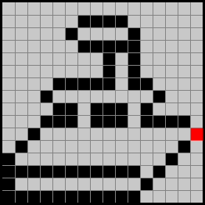

Assuming the boat only animates left to right (boats only go forward, right?),
and that we only want to check whether the boat has hit something (as opposed to
something hitting the boat), then the only point on the sprite we need to check
is the tip of the bow: the pixel coloured red in the image. That's a "hotspot."

The idea here is to calculate the pixel _x,y_ screen location where that hotspot
pixel is located, then check the colour attribute for that screen location. If
the attribute is that of the "empty background" then there's no collision; if
the attribute is that of something else then the boat has hit it.

### Example Code

The full code for this example is
[here](https://github.com/derekfountain/z88dk-zxspectrum-examples/blob/master/SP1/05_CollisionDetection/boat.c).
It looks like this:


The Y-position of the boat sprite is incremented and the boat sails across the
bottom of the screen. Each iteration we find the attribute of the display cell
where the hotspot at the tip of the bow is located. Once it gets to a green
block the boat has reached the land and stops.

The relevant loop is this one:

```
do {
  sp1_MoveSprPix(boat_sprite, &full_screen, boat_col1, boat_x_pos, boat_y_pos);
  sp1_UpdateNow();
  intrinsic_halt();

  boat_x_pos++;
  hotspot_attribute = *(zx_pxy2aaddr(boat_x_pos+HOTSPOT_X, boat_y_pos+HOTSPOT_Y));
}
while( hotspot_attribute != PAPER_GREEN );
boat_x_pos--;

```

SP1 considers the sprite's "screen position" as being that of the sprite's top
left pixel. The hotspot is 15 pixels right and 10 pixels down from that top left
corner of the sprite, so we do the additions to find the screen pixel of the
hotspot, find the attribute of the cell that pixel is located in using
_zx_pxy2aaddr()_ (which is pronounced as "_pixel x,y to attribute address_"), and
stop when the hotspot pixel gets to the first green block. The loop renders the
sprite on screen and uses a halt to sync to 50 frames per second (just to slow
the animation down a bit).

The result is this:

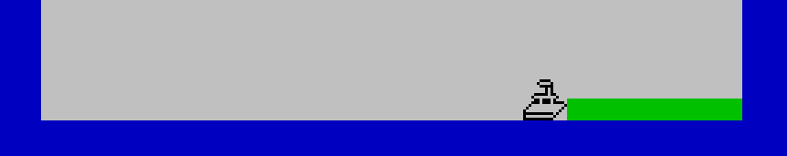

Note how this particular piece of code is structured with a do/while loop and we
actually check the attribute cell the hotspot is _about_ to enter. This is
because in this instance we want the boat to stop when when it gets _to_ the
green block, not when it actually _enters_ it. In other scenarios it might be
required to allow the actual overlap and render the sprite to the screen so the
player can see, albeit momentarily, that their sprite did in fact hit
something. If you want the sprite to bounce off the side of the screen you'll
likely need this "look ahead" type of code structure because you probably don't
want to render the sprite partially off screen.

Of course, we've hardcoded the hotspot coordinates into this piece of code for
clarity. In practise the hotspot location is more likely to be part of the
sprite data. You might use a graphics data structure with the hotspot coded in,
like:

```
extern unsigned char boat_col1[];
extern unsigned char boat_col2[];
struct
{
  unsigned char *col1;
  unsigned char *col2;

  unsigned char hotspot_x;
  unsigned char hotspot_y;
}
boat_gfx_data = { boat_col1, boat_col2, 15, 10 };
```

Your collision detection line might then be a more generic:

```
hotspot_attribute = *(zx_pxy2aaddr(boat_x_pos+boat_gfx_data.hotspot_x,
                                   boat_y_pos+boat_gfx_data.hotspot_y));
```

This example is listed in full [here](https://github.com/derekfountain/z88dk-zxspectrum-examples/tree/master/SP1/05_CollisionDetection/boat_struct.c).

This may feel like a somewhat contrived example, but there are quite a few
real world scenarios where this approach will work. Your author's game, [Wonky
One Key](https://spectrumcomputing.co.uk/entry/34686/ZX-Spectrum/ZX_Wonky_One_Key),
uses this exact approach for its [collision detection](https://github.com/derekfountain/zxwonkyonekey/blob/master/src/collision.c#L97).

### Multiple Hotspots ###

The simple example above uses a single frame sprite with a single pixel hotspot
in it, but you can have more. If your sprite is moving in multiple directions
you'll probably want hot spots on more than one side, and depending on its shape
you might want more than one hotspot.

Imagine you're using 3 frames to animate this pulsing cross:

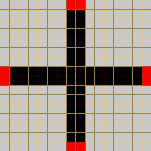


As it's moving around the screen you'll need to compute the screen coordinates
of each of those hotspots each frame, then find the value of that attribute cell
to check if it's hit something. The more hotspots you have the more resource
intensive it is to check them each frame. The bulk of the work, however, is done
in the _zx_pxy2aaddr()_ function, and as of this writing the Z88DK implementation
of that code is around 87 Z80 clock cycles, so it's still relatively efficient.

## Box and a Hotspot

The hotspot and attribute cell approach described above is essentially about
checking whether a particular sprite pixel has entered a particular "box" area
of the screen. The boxes we're talking about are 8x8 pixel cells, predefined in
hardware, being, as they are, part of the Spectrum's display. Because the cells
have a colour value associated with them which can be read very quickly the
approach lends itself to fast collision detection in cases where it works.

The problem with the hotspot and attribute cell approach is that it lacks
flexibility. It's tightly bound to the Spectrum's 32x24 attribute cell grid. A
variant of the approach is to continue to use a hotspot on the sprite, and to
check to see if that hotspot has entered a particular box-shaped area of the
screen. The box shaped area can be statically defined, or it can move around
dynamically, perhaps tracing the path of another sprite.

As an example, let's use this gemstone sprite, with the marked hotspot:


which we'll fire from the bottom of the screen up towards a chain type of
graphic (which for this example isn't actually a sprite, just something drawn on
the screen). The chain is drawn across the Spectrum's display, like so:


The chain graphic is 9 pixels high, so it doesn't fit neatly inside the
Spectrum's attribute cells. So picture an imaginary box around the chain graphic
which defines the area of the screen which "contains" the chain:


So now we can say that if the gem sprite's hotspot enters the chain's bounding
box then the gem has hit the chain. In this next graphic the two leftmost sprite
hotspots are outside the chain's box, so no hit there. The rightmost one is
inside and that gem has hit the chain.

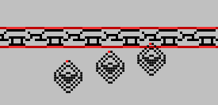

The code to implement this might be something like:

```
  if( hotspot_xpos >= chain_box.x1 && hotspot_xpos <= chain_box.x2
      &&
      hotspot_ypos >= chain_box.y1 && hotspot_ypos <= chain_box.y2 )
  {
    /* Hot spot is inside the chain's box, it has hit the chain */
    ...
```

That's 4 8-bit comparisons, which is still relatively quick to do.

In this simple example, with the sprite always approaching from the bottom of
the screen, and with its hotspot on its leading point, and with the chain going
all the way across, we don't really need to ask the question of whether the
hotspot has entered the chain's box. We only need to know if the hotspot's
screen y-position is above (lower, in pixel coordinate terms) the y-position of
the lowest boundary of the box:

```
  if( hotspot_ypos <= chain_box.y2 )
  {
    /* Hot spot has entered the chain's box from the bottom, it has hit the chain */
    ...
```

That's a very useful optimisation. But maybe this isn't a typical example. What
if the sprites were also approaching downwards, from the top?  Or the sides? 
More hotspots would be required, but you only need to check those on the leading
edge of the sprite. So which hotspot to check depends on the direction of the
sprite's travel. The chain and sprite code is in the [examples
repository](https://github.com/derekfountain/z88dk-zxspectrum-examples/tree/master/SP1/05_CollisionDetection/chain.c)
ready to be played with.

## Box Intersections

So far we've kept this discussion simple by using hotspots on sprites. It's
easy to picture a single point of a graphic entering an area of the screen as
being a hit. But although such scenarios are not uncommon, and should be looked
for in the first instance, there are plenty of other scenarios where they don't
work. Not all sprites have a convenient leading edge or tip. Irregular shaped
sprites which move in multiple directions would need so many hotspots so as to
make the approach impractical.

An alternative approach is to use _box intersections_. That is, wrap a box
around each sprite and check, after moving everything around each game loop,
whether any of the boxes intersect (i.e. overlap). The principle is much the
same as for a hotspot - we're still dealing with coordinate checking - but now
we're checking the coordinates of boxes as opposed to a single point on the
screen.

Let's look at a game where this helicopter:


flies around trying to pick up moneybags:


while avoiding these things:

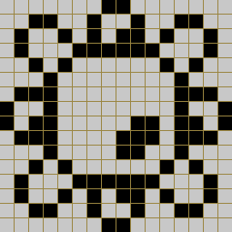

It looks like this:


and the [source](https://github.com/derekfountain/z88dk-zxspectrum-examples/blob/master/SP1/05_CollisionDetection/heli.c) is in the examples repository.

Here are the sprites with boxes wrapping them:

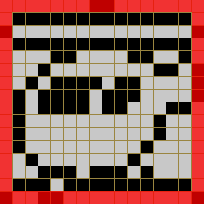


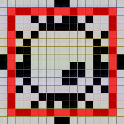

Now we can look for these boxes intersecting with each other. In this first
example the boxes wrapping the helicopter and the bomb have intersected, so
that's a collision:

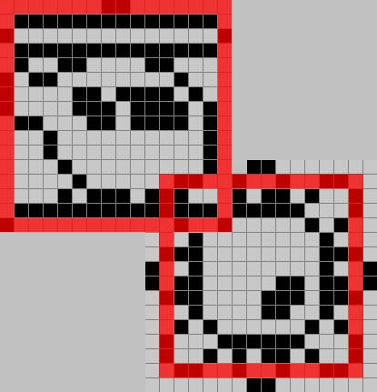

Here's another intersection:

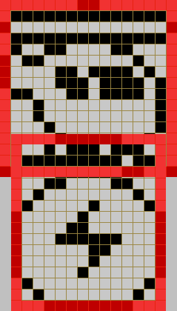

It doesn't logically matter if the helicopter came down on the moneybag or the
moneybag came up into the helicopter (do moneybags jump? maybe, if they're thrown
upwards). The fact that any part of the two sprites are overlapping means
they've collided.

Assuming the boxes are defined like this:

```
   x1,y1            x1,y1             
     +---------       *---------    
     |        |       |        |    
     |  box1  |       |  box2  |    
     |        |       |        |    
     |        |       |        |    
     ---------+       ---------*    
            x2,y2            x2,y2   

```

you can see if the boxes intersect with this code:

```
  if( ! (box2.x1 >= box1.x2 || box2.x2 <= box1.x1
          ||
         box2.y1 >= box1.y2 || box2.y2 <= box1.y1) )
  {
    /* Boxes intersect */
```

### Box Intersection Limitations

Notice how the bounding box for the bomb sprite has been defined to fit slightly
inside the pixels of the graphic. A problem with bounding boxes is that they are
rectangular, whereas many sprites and computer game characters probably
aren't. This introduces an inherent unfairness in using them for collision
detection. This is a limitation of the technique and can be compensated for by
making the bounding boxes slightly larger or smaller where necessary: where the
sprites don't quite fill their boxes we err on the side of being generous to the
player. For a bomb, which would kill the player, we make the bounding box
slightly smaller than the sprite, allowing the player to get away with just
skimming the bomb. For the moneybag, we make the bounding box slightly larger
than the sprite, meaning it will be picked up when the player gets within a
pixel of it.

Here you can see that the pixels of the helicopter don't actually overlap the
pixels of the moneybag:

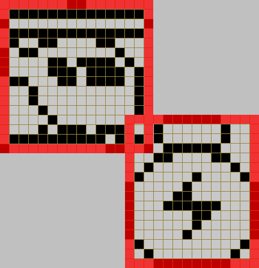

but the bounding boxes do. (Compile the example and edge the helicopter towards
the corner of a moneybag, the effect is quite clear when you're looking for it.) 
Since it's to the player's advantage it's alright to call that a hit and allow
the moneybag to get collected.

### Multiple Boxes

As we touched on above, bounding boxes are rectangular but many sprites and game
characters are not. In some cases it might be worth using multiple boxes for one
sprite. If this sprite is the player's ship:

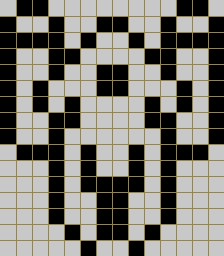

we would want the collision detection to be reasonably accurate, maybe
bordering on the forgiving towards the player. We can use 3 boxes:

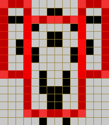

Now the collision detection needs to check each box to see if a missile (or
maybe a hotspot on the tip of a missile?) is inside any of them. This provides
better collision checking, but the work load for the Z80 has trebled, which is
going to slow the game down.

But maybe there is another optimisation which might be useful: wrap everything in a
bigger box:

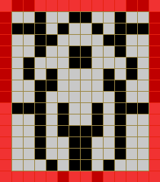

and initially check that. That is, the collision detection can test to see if there
is a collision with the large box which wraps the entire sprite. If there's not then
clearly there's no hit. If that check does result in a collision then you know
the missile is at least close to the target, in which case the 3 boxes do need
to be individually checked.

The upside of this approach is that the initial check is for a single box, and
hence in the typical case where the missile is nowhere near the player's ship
the game will continue to run quickly. The downside is that when the missile
gets near the player's ship (i.e. close enough to be inside the wrapping box)
then the workload on the Z80 suddenly becomes greater and the gameplay will slow
down. You actually end up checking 4 boxes to detect a close miss. Would that be
a problem for your game?  Is there something else you can compromise on, like
maybe not scrolling the background starfield, or not updating the score display
when those extra checks are required? Such decisions are part of game design on
a computer with very limited hardware.

As another example, have a look at the particularly tricky [mothership
sprite](https://github.com/z88dk/z88dk/blob/master/doc/ZXSpectrumZSDCCnewlib_SP1_04_BiggerSprites.md#a-bigger-example)
used in a previous article in this series:


How many boxes would be needed to accurately check whether a missile sprite has
collided with that? How many could the programmer get away with while remaining
fair to the player? What other optimisations might be available?

Box intersections can get complex. Here are some more sprites to consider, each
shown with a bounding box:


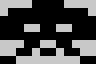


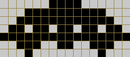


Notice how those sprites are all slightly different sizes. Each bounding box is
a little different.

Now put lots of them in a game, with, say, this target rich environment:


As the invaders move around, you have to track each individual invader's
bounding box, so you always know the area of the screen it's occupying. As the
player sends missiles into the swarm, you need to track the bounding boxes of
the missile sprite(s) and check them against each invader. You need to make these
checks each game loop, so clearly, the more invaders you have buzzing around the
screen, and the more missiles the player is allowed to have in play at any one
time, the more work the Z80 has to do. If you overdo it the game will bog
down. The more optimisations you find the more frenetic the game can be.

### Diamond Shaped Boxes

The idea of using square or rectangular boxes for intersection checking is quite
intuitive, but there's another somewhat less obvious option which is useful for
sprites of certain shapes: use diamond shaped boxes. A diamond shaped box is
just a square which has been rotated 45 degrees:


This approach requires knowing the centre coordinates of 2 sprites, so for SP1,
which uses the top left corner of the sprite as its origin point, you'll need to
calculate the sprite centre point. Once you've done so you can check whether 2
bounding diamond shapes, with centres _x,y_ and _q,p_, have collided by using this
piece of code:

```
  #define COLLISION_THRESHOLD 16

  if( ( abs(x - q) + abs(y - p) ) < COLLISION_THRESHOLD )
  {
    /* Sprites have collided */
    ...
```

If _y_ and _q_ are the same (i.e. the sprites are on the same vertical line of the
screen) then you have a collision if the centres are within the sprite width of
each other. For each vertical line they are separated by, the sprites have to be
one pixel closer horizontally to conclude an overlap. The result looks like a
diamond, and you can adjust the harshness of the test by tweaking the threshold
value.

The result looks like this:

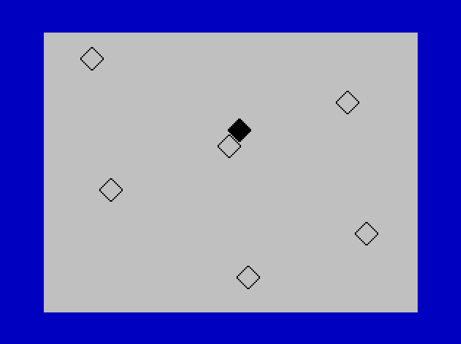

Note how sprites of diamond shape can get much closer to each other than
a square bounding box would allow. This
[example](https://github.com/derekfountain/z88dk-zxspectrum-examples/blob/master/SP1/05_CollisionDetection/diamond.c)
is available to play with in the examples repository.

### Intersection of Diamonds and Square

Another notable and potentially useful design pattern for intersection detection
is that achieved by first checking for a box, and if that comes back positive
checking an overlapping diamond with sides one and a half times larger:


If the box check tells you that you have a collision, and the subsequent diamond
check also tells you you have a collision, then the collision is in the grey
area of the diagram: an octagon, which is a useful approximation of a
circle. This is a useful and very quick way to check for collisions between
circular sprites, such as balls and bubbles.

## Further Reading

Collision detection is, as we can see, a complex subject with all sorts of
solutions which depend on context. This article could go on for quite
a while but we'll draw a line at this point. Your author asked on [Spectrum
Computing](https://spectrumcomputing.co.uk/forums/) for help from the assembled
experts. Notable threads are
[here](https://spectrumcomputing.co.uk/forums/viewtopic.php?f=6&t=2409&p=33749&hilit=collision#p33749)
and
[here](https://spectrumcomputing.co.uk/forums/viewtopic.php?f=6&t=2453&p=33497#p33497).
There are some interesting ideas there. The techniques are worth
exploring.

Also, Jonathan Cauldwell's excellent [How to Write Spectrum
Games](https://jonathan-cauldwell.itch.io/how-to-write-spectrum-games) book
covers the topic. It's from an assembly language perspective, but the principles
are the same.

## Conclusion

There is no right way to do collision detection, and we've only looked at a
handful of possible approaches. An inventive programmer will be able to look at
his or her sprites, their shapes and how they move, together with the rules and
constraints the game presents, and up come up with more practical
solutions. It's not a simple problem, and looking for a simple answer isn't
going to work. This is one of the key areas where the programmer earns his or
her corn.
