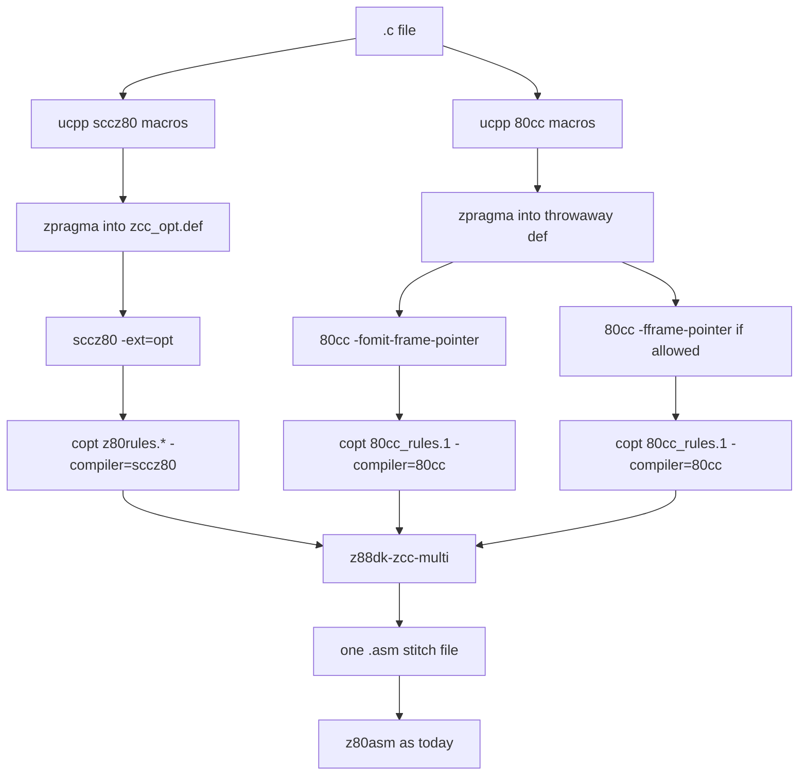

# zcc multi-compiler selection

| Field | Value |
|-------|-------|
| Title | zcc multi-compiler selection |
| Author | z88dk |
| Date | 2026-08-21 |
| Status | Implemented |
| Type | Specification |

This document is the specification of the live selector.

The key words MUST, MUST NOT, SHOULD, SHOULD NOT, and MAY have the meanings in RFC 2119.

The tool is `z88dk-zcc-multi` in `src/zcc-multi/`. zcc drives it from `compile_c_multi()` in `src/zcc/zcc.c`.

## Overview

A C translation unit can have more than one compiler body for the same function.

`-compiler=multi` compiles the same `.c` file with sccz80 and with 80cc.

The number of variants follows 80cc CPU capability, not a private CPU list.

sccz80 does not offer a frame-pointer mode in this design.

Run `80cc-fp` only when 80cc treats the CPU as having IX.

1. `sccz80` — sccz80 default. Locals use the stack. Multi does not pass `-frameix`.
2. `80cc-sp` — 80cc with `-fomit-frame-pointer`. Always.
3. `80cc-fp` — 80cc with `-fframe-pointer` (IX frame). Only when 80cc says IX exists.

If 80cc says the CPU has no IX, the run is two variants: `sccz80` and `80cc-sp`.

Each variant runs through `z88dk-copt` with the matching rule set.

`z88dk-zcc-multi` then selects the best body per function.

The default metric is a static T-state estimate. Size is the other metric.

The tool writes one assembly file.

`z88dk-z80asm` then assembles that file on the existing path.

The ABI is not fully the same for IX and IY.

The feature ships on the verified common subset.

The specification records the mismatches and the mixing rule.

## Background and motivation

zcc selects one compiler per run.

`src/zcc/zcc.c` stores the choice in `c_compiler_type` and `compiler_type`.

The known values are `CC_SCCZ80`, `CC_SDCC`, `CC_EZ80CLANG`, `CC_80CC`, and `CC_XCC`.

sccz80 and 80cc share the classic small-C calling convention.

They share the `l_*` runtime under `libsrc/l/sccz80/`.

They do not emit the same instruction stream.

A user who wants the smaller or cheaper body today must compile the file twice by hand.

That work does not mix functions from two compilers in one object.

`-compiler=multi` does that mix after copt.

The mix is per function.

The mix is not whole-program LTO.

## Goals and non-goals

### Goals

1. Add `-compiler=multi`.
2. Compile each `.c` file with the variant count that 80cc allows on that CPU.
3. Pass the same CPU `-m` flags that zcc already uses for sccz80, 80cc, copt, and z80asm.
4. Run copt on each variant with the matching rules.
5. Select one body per function by ticks (default) or by assembled size.
6. Stitch one assembly file that z80asm already accepts.
7. Keep the existing assemble and link path after that file.
8. With `-v`, print per-function winners and a selection summary.
9. Keep the selector host-neutral so a later 80cc switch can reuse it. Do not change 80cc in this version.

### Non-goals

1. zsdcc and ez80clang are not variants.
2. Classic clib and newlib cores MUST NOT be mixed.
3. Library ABI MUST NOT change.
4. Multi MUST NOT rewrite hand-written `.asm`.
5. Multi MUST NOT run copt on hand-written library asm.
6. Multi does not do whole-program selection across translation units.
7. Multi does not add a per-function pragma.
8. Multi does not run a program in `z88dk-ticks` to score a function.
9. Multi does not change `src/80cc`. The later in-compiler switch is a design constraint only.

## Key decisions

| Decision | Choice | Rationale |
|----------|--------|-----------|
| Switch | `-compiler=multi` | User requirement. Matches `-compiler=sccz80`. |
| Metric flags | `-compiler-metric=ticks` (default) and `-compiler-metric=size` | Multi is already selected by `-compiler=multi`. Ticks is the compile-time proxy. |
| Tool shape | Binary `z88dk-zcc-multi` | Parser and selector are not trivial. zcc already shells to copt and z80asm via `process()`. |
| Data source | sccz80 variant | Named objects must appear once. sccz80 is the default compiler. |
| Preprocess | Once per variant | Benches use `#ifdef __80CC`. One preprocess would drop that path. |
| zcc_opt.def | sccz80 zpragma output only | A second zpragma pass would duplicate pragmas. |
| Failure | Any variant compile or copt error fails the file | Silent fallback hides a broken compiler. |
| Ticks | Static T-state sum from assembly source | 80cc listings can put a wrong source line on an opcode. Size still uses the listing. |
| Loop trips | Literal bound only. Unknown stays 1. Load 0 wraps | 8-bit 0 is 256. 16-bit 0 is 65536. `dec rr` does not set Z. Overlapping edges multiply (B × C). |
| Block repeats | `21 × BC` for `ldir` / `cpir` and friends. Unknown BC is `ZCCMULTI_BLOCK_REP` (2) | Same stand-in on every variant. |
| Helper charge | Differential. `(count[v] − min) × helper` | A shared `l_mult` in every body cancels. Extra sites change the winner. |
| Helper walk | `libsrc/l/sccz80`, `libsrc/math/float`, `libsrc/math/integer` | Classic integer leaves sit under `math/integer`. Skip `obj/`. Do not assemble `config_private.inc` dispatchers. |
| Intra-TU | Same-variant callee `base_*`. Ticks per site. Size unique | Nested C in one file is part of the body cost. |
| Metric goal | Be right about 90% of the time on TIMER-ish picks | Not a profiler. Do not specialise on TIMER or hotspots. |
| Tie-break | Equal ticks then size. Equal size then variant priority | Stable output. |
| Variant priority | sccz80, then 80cc-sp, then 80cc-fp | sccz80 is the default compiler. 80cc-sp is the 80cc default. |
| sccz80 frame | Stack default only. Do not pass `-frameix` | sccz80 frame-pointer codegen is marked broken in `src/sccz80/codegen.c`. The three-way mix is sccz80 + 80cc-sp + 80cc-fp. |
| Who gets 80cc-fp | Only if 80cc says the CPU has IX | Copy 80cc index-register tests. sccz80 has no frame-pointer path. Do not keep a private CPU list. |
| CPU flags | Reuse `cpu_map[]` / `select_cpu()` | Do not invent a second CPU table. sccz80 and 80cc take `CPU_MAP_TOOL_SCCZ80`. z80asm takes `CPU_MAP_TOOL_Z80ASM` including extra flags such as `-IXIY`. |
| `-v` stats | Per-function winners plus a file summary | A user must see counts, shares, and size or ticks saved against sccz80. |
| Later 80cc host | Selector talks to named variant bodies, not to zcc | A later 80cc switch can emit `80cc-sp` and `80cc-fp` inside one compile. Do not change 80cc now. |
| IX mix | 80cc-fp MUST NOT call a selected non-fp body. Costed elevate versus demote | 80cc-fp keeps a live IX frame. sccz80 and 80cc-sp may clobber IX. Pick the cheaper legal fix. |
| sdcc | Out of scope | sdcc uses a different calling convention. |
| Naked and interrupt | Selectable | They are ordinary labelled bodies after copt. |
| File-scope asm | Not selectable. Take from the data variant | It is not a C function. |

## CLI

### New switches

| Switch | Type | Default | Meaning |
|--------|------|---------|---------|
| `-compiler=multi` | existing `compiler` string | n/a | Enable multi mode. |
| `-compiler-metric=ticks` | new string | `ticks` | Select the lower static T-state sum. |
| `-compiler-metric=size` | new string | | Select the smaller assembled body. |
| `-compiler-multi-report=path` | new string | unset | Write a TSV report. |

Unknown metric values MUST be an error.

`-compiler-metric` is only used with `-compiler=multi`.

`option_parse()` matches a long name as a prefix.

`-compiler-metric` and `-compiler-multi-report` MUST stand before `-compiler` in the option table.

If they stand after it, `-compiler-metric=size` is parsed as `-compiler=-metric=size`.

### Precedence

`option_parse()` in `src/common/option.c` writes `c_compiler_type` each time.

The last `-compiler=` on the command line wins.

If the last value is `multi`, multi mode is on.

If the last value is `sccz80`, `80cc`, `sdcc`, `xcc`, or `ez80clang`, multi mode is off.

A config `OPTIONS` line that sets `-compiler=sdcc` and a later user `-compiler=multi` therefore selects multi.

If multi is on and the clib recipe is an sdcc recipe (`sdcc_ix`, `sdcc_iy`), zcc MUST fail.

The error MUST say that `-compiler=multi` does not support the sdcc ABI.

### Frame-pointer flags

zcc has no native `-fframe-pointer` option.

Unknown leftover flags go to `add_option_to_compiler()` in `src/zcc/zcc.c`.

That is how `zcc -compiler=80cc -fframe-pointer` works today.

`-Cc` appends to `sccz80arg`.

Both sccz80 and 80cc consume `sccz80arg` in `configure_compiler()`.

Under `-compiler=multi` the driver owns the frame-pointer choice.

If the user passes `-fframe-pointer`, `-fomit-frame-pointer`, `-Cc-fframe-pointer`, or `-Cc-fomit-frame-pointer`, zcc MUST fail.

The error MUST say that multi selects those flags per variant.

`-Cc` other flags apply to both compilers.

If 80cc rejects a `-Cc` flag, the file fails.

Do not pass sccz80-only flags with multi.

### Scope of inputs

Multi applies only to `.c` inputs.

`.i` inputs follow the same compile path after preprocess.

`.asm`, `.s`, `.o`, and `.m4` pass through unchanged.

C++ is not supported. `configure_compiler()` already rejects C++ except for ez80clang.

### Lifecycle flags

| Flag | Behaviour under multi |
|------|------------------------|
| `-E` | Preprocess only. zcc SHOULD preprocess the sccz80 variant only. |
| `-a` / `-S` | Stop after the stitch file. Copy the stitch `.asm` as today. |
| `-c` | Stitch, then assemble to `.o` as today. |
| `-m` | Map of the final binary. Unchanged. |
| `-O` | Peephole level for each variant. Same `peepholeopt` for all. |
| `-Ca` | Assembler flags. Applied once to the stitch file. |
| `-Cl` | Linker flags. Unchanged. |
| `-v` | Print every tool command. Print per-function winners and the selection summary. |
| `-vn` | Quiet. No winner lines. No summary. |
| `--math-mbf32` | Allowed with 80cc-fp. See [Float libraries and IX](#float-libraries-and-ix). |

### Verbose lines

With `-v`, zcc MUST print one line per selectable function.

Then zcc MUST print a selection summary for the file.

The tool `z88dk-zcc-multi --verbose` MUST emit the same text on stderr.

Example per function:

```text
zcc-multi: _foo selected=80cc-fp sccz80=42/130 80cc-sp=40/125 80cc-fp=38/120
```

The line MUST name the C symbol with the `_` prefix.

Each variant column is `size/ticks`.

Missing variant columns MUST show `-`.

After the function lines, print the summary. See [Selection summary](#selection-summary).

### Report file

`-compiler-multi-report=path` writes UTF-8 TSV.

The first line is a header.

```text
function	selected	reason	size_sccz80	size_80cc-sp	size_80cc-fp	ticks_sccz80	ticks_80cc-sp	ticks_80cc-fp
_foo	80cc-fp	metric	42	40	38	130	125	120
_bar	80cc-fp	ix-elevate	20	18	16	80	70	60
```

`reason` is `metric`, `only`, `ix-elevate`, `ix-callee`, or `fallback`.

The file MUST be parseable by `awk` and by a spreadsheet.

### Selection summary

With `-v`, after the per-function lines, print a summary block.

The block MUST start with `zcc-multi-summary:`.

Required fields, one key=value pair per line after the header, or one line with spaces. Use this exact shape:

```text
zcc-multi-summary: file=foo.c cpu=z80 metric=size functions=12
zcc-multi-summary: selected sccz80=7 80cc-sp=4 80cc-fp=1
zcc-multi-summary: share sccz80=58.3% 80cc-sp=33.3% 80cc-fp=8.3%
zcc-multi-summary: bytes selected=410 sccz80=480 80cc-sp=455 80cc-fp=512 saved_vs_sccz80=70
zcc-multi-summary: ticks selected=2100 sccz80=2400 80cc-sp=2300 80cc-fp=2600 saved_vs_sccz80=300
zcc-multi-summary: mixed=5 only=1 ix-elevate=1 ix-callee=0 fallback=0
```

Meanings:

| Field | Meaning |
|-------|---------|
| `functions` | Count of selectable C functions in the file |
| `selected <variant>=N` | How many functions that variant won |
| `share` | Same counts as percent of `functions`, one decimal |
| `bytes selected` | Sum of assembled sizes of the winning bodies |
| `bytes <variant>` | Sum of that variant's sizes for functions it emitted |
| `saved_vs_sccz80` | `bytes sccz80` minus `bytes selected`. May be negative |
| `ticks ...` | Same sums for the ticks metric. Print even when the metric is size |
| `mixed` | Functions where at least two variants had a body and the winner was not sccz80 |
| `only` | Functions present in one variant only |
| `ix-elevate` | Callee switched to 80cc-fp so an 80cc-fp caller stays valid |
| `ix-callee` | Caller left 80cc-fp because that fix was cheaper, or the callee had no 80cc-fp body |
| `fallback` | Functions that fell back from ticks to size |

A missing variant (two-variant CPU) MUST omit that variant from `selected` and `share`.

Do not count file-scope data as a function.

The TSV report MUST grow a second table after a blank line, headed `summary`, with the same keys.

A later 80cc host MUST print this same summary. Keep the prefix `zcc-multi-summary:` even inside 80cc so scripts stay stable.

## Variant matrix

Use the existing `CPU_TYPE_*` tokens from `src/zcc/zcc.c`.

Do not invent a new CPU list.

Do not keep a table of which CPUs get two variants and which get three.

Derive that from 80cc.

### When IX exists

`80cc-fp` is allowed only when 80cc treats the CPU as having IX.

sccz80 does not do frame-pointer compilation. Do not consult sccz80 for this decision.

Read the tests from 80cc. Do not copy a CPU name list into this document.

80cc today:

- `src/80cc/main.c` sets `c_framepointer_is_ix = -1` on CPUs with no index registers.
- `IS_808x()` and `IS_GBZ80()` in `src/80cc/ir_lower.c` refuse IX save.

zcc copies those three pins in `multi_cpu_has_ix()`: 8080, 8085, and gbz80 have no IX.

If 80cc later treats another CPU as having no IX, multi MUST follow.

A default of `-fomit-frame-pointer` on a CPU that still has IX is not a ban.

On such a CPU multi MUST still run `80cc-fp`. The metric may then drop a larger body.

sccz80 stays on its default stack frame on every CPU.

Multi MUST NOT pass `-frameix` or `-frameiy` to sccz80.

| IX on this CPU | Variants |
|----------------|----------|
| No | `sccz80`, `80cc-sp` |
| Yes | `sccz80`, `80cc-sp`, `80cc-fp` |

Variant names in reports and comments MUST be `sccz80`, `80cc-sp`, and `80cc-fp`.

### CPU flags

Each variant MUST receive the flags that a single-compiler zcc run already passes for that CPU.

Take them from `cpu_map[]` in `src/zcc/zcc.c` via `select_cpu()`.

| Tool | Map slot | Role |
|------|----------|------|
| sccz80 | `CPU_MAP_TOOL_SCCZ80` | Compiler `-m` |
| 80cc | `CPU_MAP_TOOL_SCCZ80` | Same slot. 80cc is the sccz80-family compiler |
| copt | `CPU_MAP_TOOL_COPT` | Peephole `-m` |
| z80asm (size, ticks, final assemble) | `CPU_MAP_TOOL_Z80ASM` | Assembler `-m` |

Do not hard-code `-mz80` for every CPU.

Do not duplicate `cpu_map[]` in this document.

`z88dk-zcc-multi --cpu=` MUST use the z80asm token from `select_cpu(CPU_MAP_TOOL_Z80ASM)` without a leading `-m`.

`z88dk-zcc-multi --asm-flags=` MUST pass the full `select_cpu(CPU_MAP_TOOL_Z80ASM)` string.

If that slot contains extra assembler flags (for example `-IXIY`), pass them on the z80asm line. Do not drop them.

copt CPU rules still come from `CPU_MAP_TOOL_CPURULES` as today.

If `cpu_map[]` changes, the implementation MUST follow it.

### Forced drop of 80cc-fp

Drop 80cc-fp when any of these hold.

1. 80cc says this CPU has no IX.
2. The user reserved IX (`--reserve-regs-ix` on the zcc line or in `-Cc`).

Do not drop 80cc-fp because of the float library.

When 80cc-fp is dropped, the run is a two-variant run.

The report MUST leave the 80cc-fp columns empty.

### Float libraries and IX

math32 does not use IX. Multi MAY use 80cc-fp with `--math32`.

math48 uses IX. Both sccz80 and 80cc already compile against that library. Multi MUST still run 80cc-fp when the CPU has IX.

An 80cc-fp C function that calls a non-fp C function in the same file is a different problem. See [IX mix](#5-callee-saved-registers-especially-ix-and-iy).

### 80cc not present

If `c_80cc_exe` cannot run, zcc MUST fail.

Config keys:

```text
80CCEXE        Name of 80cc binary          default z88dk-80cc
ZCCMULTIEXE    Name of the multi tool       default z88dk-zcc-multi
```

## Pipeline



### Preprocess

Each variant MUST run ucpp with its own macros.

sccz80 macros match `configure_compiler()` today:

```text
-DSCCZ80 -DSMALL_C -D__SCCZ80
```

80cc macros match `configure_compiler()` today:

```text
-DSCCZ80 -DSMALL_C -D__SCCZ80 -D__80CC
```

Both variants also get `-D__Z88DK` and the target defines.

This is required.

`support/benchmarks/*/z88dk-classic/*.c` uses `#ifdef __80CC` for TIMER labels.

One shared `.i` would drop those labels on the 80cc path.

### zpragma and zcc_opt.def

zcc now writes `zcc_opt.def` under a unique `/tmp/tmpzccXXXXXXXX` directory.

See `src/zcc/zcc.c` around the `mkdtemp` call.

A second zpragma pass on the same file would duplicate `defc` lines.

The sccz80 zpragma pass MUST write the link-time `zcc_opt.def`.

Each 80cc zpragma pass MUST write a throwaway file.

CRT m4 MUST read the sccz80 `zcc_opt.def` only.

### Compile

Each variant compiles `.i` to `.opt` with `-ext=opt` and `-zcc-opt=` as today.

The compiler CPU flag MUST be `select_cpu(CPU_MAP_TOOL_SCCZ80)`.

sccz80 command extra flags come from `sccz80arg` except frame-pointer flags.

80cc-sp MUST pass `-fomit-frame-pointer`.

80cc-fp MUST pass `-fframe-pointer`.

80cc already defaults to omit.

The explicit flag records the intent.

Do not copy the existing typo `BuildOptions(&linkargs, "-D__80")` from the 80cc branch.

The asm and link defines for 80cc remain `-D__SCCZ80` and `-D__80CC`.

Under multi the stitch file is not compiler-specific.

The link defines MUST be `-D__SCCZ80 -D__80CC -D__COMPILER_MULTI`.

### copt

Each variant MUST run `apply_copt_rules()` with the matching set.

sccz80 uses `c_coptrules9` plus the `-O` set from `z80rules.2`, `z80rules.1`, and `z80rules.0`.

sccz80 also uses `COPTRULESTARGET`, CPU rules, `COPTRULESINLINE` when set, and user rules.

80cc uses `c_coptrules9` plus `c_80cc_opt` (`lib/80cc_rules.1`).

80cc also uses target, CPU, and user rules.

copt MUST receive `-compiler=sccz80` or `-compiler=80cc`.

`src/copt/copt.c` uses that value for `%compiler` and `%notcompiler`.

Hand-written library asm MUST NOT go through this path.

### Temp names

zcc already allocates one `temporary_filenames[i]` per input via `tempname()`.

Variant files MUST use extra suffixes on that base.

| Stage | sccz80 | 80cc-sp | 80cc-fp |
|-------|--------|---------|---------|
| ucpp | `.sccz80.i2` | `.80cc.i2` | reuse `.80cc.i2` |
| zpragma | `.sccz80.i` | `.80cc-sp.i` | `.80cc-fp.i` |
| compile | `.sccz80.opt` | `.80cc-sp.opt` | `.80cc-fp.opt` |
| copt ping-pong | `.sccz80.op1` | `.80cc-sp.op1` | `.80cc-fp.op1` |
| post-copt | `.sccz80.asm` | `.80cc-sp.asm` | `.80cc-fp.asm` |
| stitch | `.asm` | | |

80cc-sp and 80cc-fp MAY share the ucpp output.

They MUST NOT share the compiler output.

The stitch file uses the existing `.asm` name so the later `CASE_ASMFILE` path is unchanged.

Two zcc processes in one cwd already use `/tmp` names.

They still MUST NOT share a cwd `zcc_opt.def` if an old client writes one.

Multi does not make that race worse.

### Failure policy

If ucpp, zpragma, the compiler, or copt fails for any required variant, zcc MUST fail the file.

zcc MUST NOT drop that variant and continue.

A missing optional 80cc-fp (80cc force-off on this CPU, or reserved IX) is not a failure.

If a function label is absent from every variant, the tool MUST fail.

If a function is absent from one variant, the tool MUST use the variants that have it.

`reason` is then `only` or `fallback`.

80cc may skip or inline a body that sccz80 emits.

That case is expected.

## Function identity

### Recognition

After copt both compilers emit a function like this.

```asm
; Function foo flags 0x00000200 __smallc
; int foo(int a)
; parameter 'int a' at sp+2 size(2)
	C_LINE	10,"foo.c::foo::0::0"
._foo
	ld	hl,2
	add	hl,sp
	...
	ret
```

A selectable function starts at a file-scope code label.

Accepted label forms:

| Form | Source |
|------|--------|
| `._name` | Default C function. `prefix()` writes `.`. `Z80ASM_PREFIX` is `_`. |
| `.name` | `dopref() == NO`. Rare asm name. |
| `name:` | Colon form if copt or a user insert adds it. |

`GLOBAL _name` at the end of the file is a declaration.

It is not a function start.

80cc IR also emits `L_fN_bb_M:` inside the body.

Those labels belong to the enclosing function.

sccz80 emits `i_N` for local labels and for the file literal pool.

### Extent

The function body starts at the function label.

The body ends at the next file-scope function label.

The body also ends at a file-scope data label `._var` in `bss_compiler` or `data_compiler`.

The body also ends at `; --- Start of Optimiser additions ---`.

The body also ends at `; --- Start of Static Variables ---`.

The body also ends at `; --- Start of Scope Defns ---`.

The body also ends at end of file.

Nested labels stay in the function.

`SECTION` lines inside the body stay in the function.

A switch table that sits under local labels after `ret` stays in the function if no new file-scope function started.

### Not selectable

These items are not functions.

1. File-scope data, bss, and rodata objects with a stable C name.
2. The shared literal pool `.i_1` / `i_N` dump after the optimiser banner.
3. `MODULE`, `INCLUDE`, and file-level `GLOBAL` / `EXTERN` lists.
4. Banner comments and include `C_LINE` lines before the first function.
5. Whole-file `__asm` blobs that are not a C function.

### Special functions

| Kind | Rule |
|------|------|
| `static` | Selectable. The label is still `._name`. |
| `naked` | Selectable. |
| `interrupt` | Selectable. |
| `__critical` | Selectable. |
| `__z88dk_callee` / `__z88dk_fastcall` | Selectable. ABI is shared. |
| `__banked` | Selectable. Both compilers emit `banked_call`. |
| File-scope asm | Not selectable. Copy from the data variant. |

## Size metric

Size is the assembled byte count of the function unit.

Size is not the source line count.

### How to measure

`z88dk-zcc-multi` MUST assemble each variant file with `z88dk-z80asm`.

The CPU flag MUST match the compile CPU.

The assembler line MUST include `--asm-flags=` from `select_cpu(CPU_MAP_TOOL_Z80ASM)`.

Example:

```text
z88dk-z80asm -mz80 -l -I"<z88dk>/lib" -o <tmp.o> <variant.asm>
```

The tool MUST parse the `.lis` file for opcode bytes.

The size of a function is the sum of opcode bytes from the function label to the end of the function unit, plus extra helper size as defined below.

`INCLUDE "z80_crt0.hdr"` contributes no function bytes.

`SECTION` padding outside the function MUST be excluded.

`defb` / `defw` / `defm` that belong to the function unit MUST be included.

A `call` encoding is part of the function body size.

Relocatable operands count at their assembled width.

JR versus JP differences appear in the listing.

That is required.

If z80asm fails on a variant file, the tool MUST fail.

A post-copt file that does not assemble is a file failure.

Store that listing sum as `base_size` before intra-TU and helper extras.

### Helpers (size and ticks)

A helper is a runtime routine, not a selectable C function in this file.

Treat these names as helpers:

- `l_*` from classic integer and sccz80 runtime
- `d*` classic float helpers (`dadd`, `dload`, `dmul`, …)

Do not treat `_foo` in this translation unit as a helper. That body is selected on its own.

A call to an unknown name that is not a function in this file MUST be treated as a helper if it matches the prefixes above. Otherwise charge the `call` only.

Shared helpers do not differentiate variants.

If every variant of a function calls `l_mult` the same number of times, that helper MUST NOT change the score.

Charge only the extra sites:

```text
extra = count[v] − min_count
ticks += helper_ticks × extra
size  += helper_size     if extra > 0
```

`count[v]` is the call weight. The loop product on that line is included.

Size adds the helper body once when this variant has extra sites.

Ticks add the helper static sum once per extra site.

This is not a link-time model.

The goal is to pick a body, not to match the map.

### Helper sources

Helper objects come from the classic libraries that this link would use.

Walk these trees, relative to `--asm-include=` that ends in `lib`:

1. `libsrc/l/sccz80`
2. `libsrc/math/float`
3. `libsrc/math/integer`

Skip directories named `obj`, `Debug`, and `Release`.

Do not walk `libsrc/l/util` or other newlib trees.

Index `PUBLIC` / `GLOBAL` names in each `.asm` file.

Follow `defc` aliases and `call` / `jp` to other helpers.

Prefer a CPU leaf when the name matches `--cpu=`:

| CPU token | Preferred prefix |
|-----------|------------------|
| `z80n` | `l_z80n_*` |
| `z180` / `ez80*` | `l_z180_*` |
| `kc160` | `l_kc160_*` |
| Rabbit (`r2*` / `r3*` / `r4*` / `r6*`) | `l_r2ka_*` |

Otherwise prefer `l_small_*` over `l_fast_*`.

Integer dispatchers `INCLUDE "config_private.inc"`.

Those files are not assembled. Score their ticks from source. Size stays 0 until an alias leaf is measured.

If a helper calls another helper, include that callee once in the helper size.

If the helper graph has a cycle, count each name once.

Cache helper size and helper ticks for the process.

If a helper cannot be measured, charge nothing extra for it.

## Ticks metric

The tool MUST NOT run the function in `z88dk-ticks`.

A function is not a program.

Arguments and globals are not available.

TIMER labels are not present in arbitrary code.

This is not a profiler.

Do not specialise the score on TIMER or on hotspot traces.

### Definition

The ticks score is a static T-state sum.

Size uses listing opcode bytes after the function label. The tool does not use listing line numbers.

Ticks use the assembly source text.

80cc listings can put a wrong source line number on an opcode.

The tool scores each source line that `looks_like_insn` accepts with `ticks_for_src`.

`ticks_for_src` reads the mnemonic and the operands. It does not use a listing byte count. `ld hl,n` is 10 T. `ld a,n` is 7 T. `ld a,b` is 4 T. A z80asm synthetic `ld de,hl` is 8 T.

An unknown mnemonic or `halt` sets the fallback flag.

Tables live in `src/zcc-multi/zccmulti_ticks.c`.

The CPU model follows `--cpu=`.

| `--cpu=` | Tick table |
|----------|------------|
| `z80` | Z80 |
| `z80n` | Z80N |
| `z180` | Z180 |
| `kc160` | Z180 times |
| `8080` | 8080 |
| `8085` | 8085 |
| `gbz80` | gbz80 |

The ticks `-m` flag MUST stand before any binary path if a later change runs ticks.

This version does not run that binary.

Store the source sum as `base_ticks` before intra-TU and helper extras.

### Branch policy

| Instruction | Cost in the sum |
|-------------|-----------------|
| Straight-line op | Documented T-states |
| Forward `jr cc` / `jp cc` | Not-taken cost |
| Backward `jr cc` / `jp cc` / `djnz` | Taken cost, then a literal trip if one exists |
| Unconditional `jr` / `jp` | Always-taken cost |
| `call` / `rst` to a C function in this file | Cost of the call instruction, plus intra-TU `base_ticks` (see below) |
| `call` / `rst` / `jp` to a helper | Cost of the call or jump, plus differential helper ticks |
| `ret` / `ret cc` | Unconditional `ret` cost, or not-taken for a forward-style `ret cc` |
| `halt` / illegal | Fail the ticks score for that function |

A loop is a backward `jr` / `jp` / `djnz` to a label in the same function.

A trip count is used only when the bound is a literal load that the loop does not overwrite.

| Pattern | Trip |
|---------|------|
| `ld b,N` then `djnz` | N. `ld b,0` is 256 |
| `ld r,N` then `dec r` and `jp nz` | N. `ld r,0` is 256. 8-bit `dec` sets Z |
| `ld rr,N` then `dec rr` / `ld a,hi` / `or lo` / `jp nz` | N. `ld rr,0` is 65536 |
| 8085 `ld rr,N` then `dec rr` / `jp nk` or `jp k` | N. Same wrap at 0. K sets when the pair goes 0 to −1 |
| `ld bc,N` / `ld de,N` / `ld hl,N` feeding an 8-bit half | High byte feeds B/D/H. Low byte feeds C/E/L. A 0 byte is 256 |
| `inc` or `dec` of the counter inside the span | Not a counted loop. Trip stays 1 |
| `dec rr` then `jp nz` with no `or` | Not a counted loop. Trip stays 1 |

`dec rr` does not set Z on any CPU. The portable 16-bit test is `or` through A.

8085 `jp k` / `jp nk` after `dec rr` is a general 16-bit loop. It is not only for a load of 0.

A load of 0 is a wrap. It is not an empty loop.

Unknown bounds stay 1.

Overlapping backward edges multiply.

A B loop around a C loop charges B × C on the inner span.

The product is capped at 1 000 000.

### Block repeats

These opcodes are not one step in the score:

`ldir`, `lddr`, `cpir`, `cpdr`, `inir`, `indr`, `otir`, `otdr`.

If `ld bc,N` appears before the opcode in the function, use N.

`ld bc,0` is 65536 repeats. It is the 16-bit wrap.

Otherwise use `ZCCMULTI_BLOCK_REP`.

That macro is 2 in `zccmulti.c`.

Cost is `21 × repeats`.

The last Z80 repeat is 16 T. `21 × n` is a conservative stand-in.

Unknown BC gets the same factor on every variant.

### Intra-file C calls

A `call` to another selectable function in the same variant adds that callee `base_ticks` at each site.

The site multiplier is the loop product on that line.

Size adds the callee `base_size` once per unique callee.

`base_*` is the body before helpers.

Do not follow a recursive call to self.

### What the score is not

The score still undercounts a hot loop whose bound is not a literal.

The score still overcounts a rare error path.

Differential helpers fix the case where a small helper-heavy body beats a larger inlined body.

They also stop a shared `l_mult` from hiding the wrapper delta.

The score does not match TIMER.

A user who needs true TIMER numbers MUST still run `z88dk-ticks` on the linked program.

See `.agents/skills/tool-ticks/SKILL.md` and `.agents/skills/methodology-measure/SKILL.md`.

### Fallback

If the source has `jp (hl)`, `jp (ix)`, `jp (iy)`, or an unknown opcode, the tool MUST NOT use ticks for that function.

It MUST fall back to size for that function only.

`reason` is `fallback`.

### Tie-break

1. Lower ticks wins when the metric is `ticks`.
2. If ticks are equal, or ticks are not usable, lower size wins.
3. If size is equal, variant priority wins.

Priority order is:

1. `sccz80`
2. `80cc-sp`
3. `80cc-fp`

When the metric is `size`, skip step 1.

## Stitch

The stitch file MUST be valid input for `z88dk-z80asm`.

### File layout

1. A banner comment that names the metric and the data variant.
2. `MODULE` from the data variant.
3. `INCLUDE "z80_crt0.hdr"`.
4. File-level `C_LINE` include trace from the data variant. Optional.
5. Selected function units, each with a winner comment.
6. Literal pools from every variant that contributed a function.
7. File-scope data, bss, and named rodata from the data variant.
8. `GLOBAL` and `EXTERN` union from the data variant trailer.

Do not copy the optimiser banner from a variant that contributed no function.

copt can emit `defc i_N = i_M` after that banner.

copt can chain more than one `defc`.

Copy that `defc` only when the chain ends at a label in a selected body of that variant.

### Winner comment

```asm
; zcc-multi: metric=ticks data=sccz80
; zcc-multi: _foo selected=80cc-fp size=38 ticks=120 reason=metric
._foo
	...
```

### Data objects

Named file-scope objects MUST come from the sccz80 variant only.

The tool MUST compare the set of named objects across variants.

If a name exists in one variant trailer and not another, the tool MUST fail.

`#ifdef __80CC` that changes a global layout makes the file invalid for multi.

Unnamed literal pools MAY differ.

Each contributing variant keeps its own pool under rewritten labels.

### Local label rewrite

`i_1` is reused in every variant.

`L_f1_bb_0` is reused in every 80cc function index.

The stitch pass MUST rewrite local labels so they are unique in the file.

Hyphens in the variant name become underscores.

| Original | Rewrite |
|----------|---------|
| `i_N` | `i_N_sccz80` / `i_N_80cc_sp` / `i_N_80cc_fp` |
| `L_fA_bb_B` | `L_fA_bb_B_80cc_sp` |

References in operands MUST change with the definitions.

File-scope names `_foo` and `_var` MUST NOT be rewritten.

### Sections

Preserve `SECTION` directives from the selected text.

Code MUST stay in `code_compiler` unless the compile used `--codeseg`.

Data MUST stay in the same section as the data variant.

A single-compiler build and a multi build of the same sccz80-only file MUST place objects in the same sections.

### PUBLIC / GLOBAL / EXTERN

Both compilers emit `GLOBAL` at the end of the file.

See `GlobalPrefix()` in `src/sccz80/codegen.c`.

The stitch file MUST emit the union of `GLOBAL` names that remain.

The stitch file MUST emit `EXTERN` for helpers that any selected body calls.

Do not emit `GLOBAL` for a discarded function body.

### Debug / C_LINE

Keep `C_LINE` from the selected variant.

Drop `C_LINE` from discarded bodies.

`-debug` / `-debug-defc` MAY produce `__CDBINFO__` symbols.

Those symbols MUST come from the selected body only.

If two variants emit the same `__CDBINFO__` name, keep the selected body.

### Discarded bodies

Do not keep losing-variant function bodies.

## Tool shape

### Name

Binary: `z88dk-zcc-multi`

Source: `src/zcc-multi/`

| File | Role |
|------|------|
| `zccmulti.c` | Parse, measure, select, stitch |
| `zccmulti_ticks.c` | CPU T-states, listing parse, control / `ld` / `dec` |
| `zccmulti_ticks.h` | Tick API |
| `t/*.asm` | Host fixtures for the selector |
| `test/suites/zcc-multi/` | zcc and tool tests |

zcc invokes it the same way it invokes `z88dk-copt`.

See `process()` and `compile_c_multi()` in `src/zcc/zcc.c`.

### argv

```text
z88dk-zcc-multi
    --cpu=<cpu>
    --metric=size|ticks
    --data-variant=sccz80
    --variant=<name>:<path.asm>
    --output=<path.asm>
    [--report=<path.tsv>]
    [--verbose]
    [--z80asm=<path>]
    [--asm-flags=<z80asm -m…>]
    [--asm-include=<dir>]
    [--list-dir=<dir>]
    [--source=<path.c>]
```

`--variant` MAY repeat.

`--cpu` uses the z80asm token from `select_cpu(CPU_MAP_TOOL_Z80ASM)` with the leading `-m` removed.

`--asm-flags` is the full `select_cpu(CPU_MAP_TOOL_Z80ASM)` string, including extra flags.

`--source` is the original `.c` path. The summary `file=` field uses its basename.

`--z80asm` defaults to `z88dk-z80asm`.

`--verbose` MUST print the per-function lines and the selection summary on stderr.

stdout is silent.

### Exit codes

| Code | Meaning |
|------|---------|
| 0 | Stitch file written |
| 1 | Parse, select, or metric error |
| 2 | I/O or assembler invocation error |

stderr MUST state the failing function or file.

### Config

Add to the zcc config table in `src/zcc/zcc.c`:

```text
80CCEXE        Name of 80cc binary          default z88dk-80cc
ZCCMULTIEXE    Name of the multi tool       default z88dk-zcc-multi
```

`80CCRULES` already exists and points at `DESTDIR/lib/80cc_rules.1`.

## Later host in 80cc

This version MUST NOT change `src/80cc`.

The selector MUST still be written so a later 80cc switch can reuse it.

The planned 80cc switch is a local compile option. It will run more than one codegen path inside one 80cc process. Typical paths are stack locals and IX frame. It will then pick one body per function with the same metric.

That later switch MUST NOT need zcc `-compiler=multi`.

### Seams that MUST stay host-neutral

1. A **variant** is a name plus a post-copt assembly (or later IR) body list. It is not a zcc `compiler_type`.
2. Names `80cc-sp` and `80cc-fp` are codegen modes. 80cc MAY emit both without a second process.
3. The selector API MUST accept `N` named variants, a metric, a data-variant name, and a CPU token.
4. The selector MUST NOT call `zcc` or read `c_compiler_type`.
5. Size MUST come from the listing. Ticks MUST come from source text or from tables. They MUST NOT require a zcc temp-name scheme.
6. The IX rule MUST take a callee-save class per variant name, not "this came from sccz80.exe".
7. The `-v` summary format MUST stay stable so 80cc can print the same lines.
8. `src/zcc-multi/` SHOULD stay a small C library plus a thin `main`. zcc links or execs it. Later 80cc MAY link the same library.

### What zcc owns and 80cc will not need

- Per-variant ucpp macros (`__80CC` vs not)
- Two compiler binaries
- `zcc_opt.def` split
- sdcc rejection

When 80cc hosts the selector, it only needs the 80cc-sp and 80cc-fp bodies. sccz80 is then an optional extra variant that zcc can still feed in.

### What this forbids

Do not hide selection inside `src/zcc/zcc.c` only.

Do not encode "three process() calls" as the only way to produce a variant.

Do not name the library after zcc if that blocks 80cc from linking it. `src/zcc-multi/` is acceptable. The public functions SHOULD use a short prefix such as `zccmulti_`.

## ABI compatibility

The claim that sccz80 and 80cc have a consistent ABI is only partly true.

They share the classic small-C convention between functions.

They do not share a full IX and IY callee-save contract.

The feature ships on the verified common subset below.

### 1. Default argument order

Both compilers default to left-to-right small-C.

sccz80 sets `SMALLC` when `c_use_r2l_calling_convention == NO`.

See `parse_trailing_modifiers()` in `src/sccz80/declparse.c`.

The same test exists in `src/80cc/declparse.c`.

Both default `c_use_r2l_calling_convention` to `NO`.

`-set-r2l-by-default` on zcc sets `c_sccz80_r2l_calling`.

`configure_compiler()` then passes `-set-r2l-by-default` to both compilers.

Stack layout for small-C:

- Caller pushes arguments left to right.
- The rightmost argument sits at the lowest address.
- Default `params-offset` is 2.
- That 2 is the return address.

See `-params-offset` in `src/sccz80/main.c` and `src/80cc/main.c`.

Both default `c_params_offset = 2`.

STDC / `__stdc` pushes right to left.

Both compilers implement that when `SMALLC` is clear.

`__z88dk_sdccdecl` packs stacked chars as one byte.

Both front ends accept that flag.

**Verdict:** argument order matches on the shared flags.

### 2. Return values

| Type | Register or home | Evidence |
|------|------------------|----------|
| 8-bit int / char | L, often widened in HL | 80cc `ir_lower_call.inc.c` stores a byte from L |
| 16-bit int / pointer | HL | Both. 80cc comment "Return value in HL (width ≤ 2)" |
| 32-bit int / 32-bit float | DEHL. HL is low. DE is high | sccz80 `lpush()` is `push de` then `push hl`. 80cc matches that comment |
| 48-bit classic double | FA memory accumulator | sccz80 `gen_leave_function()` maps `KIND_DOUBLE` with `c_fp_size > 4` to `KIND_NONE` |
| IEEE / math32 32-bit float | DEHL as a long | `c_fp_size == 4` maps to `KIND_LONG` in `gen_leave_function()` |
| math16 | HL as a 16-bit value | `KIND_FLOAT16` maps to `KIND_INT` |
| long long | `__i64_acc` | Both push `ld bc,__i64_acc` before some calls |
| struct argument | Copied onto the stack with `ldir` | `gen_push_function_argument()` in sccz80 |
| struct return | Same front-end rules. Both trees share the declparse shape | Forked from sccz80 |

**Verdict:** integer, pointer, and the mapped float modes match.

Classic 48-bit float is not in HL.

Callers use `d*` helpers.

Both compilers call those helpers by the same mapped names.

See the `dcallrts` table in `src/sccz80/codegen.c`.

80cc uses `acc_prim()` for `dload` / `dstore` / `dpush`.

### 3. `__z88dk_fastcall`

The last parameter arrives in registers.

It is not on the caller stack.

| Width | Registers |
|-------|-----------|
| 1 or 2 bytes | HL |
| 4 bytes | DEHL |
| classic float / long long | FA / `__i64_acc` |

80cc states this in `src/80cc/ir_alloc.c`:

```c
/* The __z88dk_fastcall arg (the last param) arrives in HL, NOT on the
   caller stack */
```

sccz80 stores the last fastcall argument after entry.

See `declparse.c` around the `FASTCALL` push of HL / DEHL.

sccz80 warns that sdcc only supports a single fastcall parameter.

Both compilers still accept multi-arg fastcall.

Earlier arguments stay on the stack.

The last argument is the register one.

**Verdict:** fastcall matches.

### 4. `__z88dk_callee`

The callee pops the stack arguments.

sccz80 `gen_leave_function()` tests `CALLEE` and `stackargs > 2`.

80cc `ir_lower_call.inc.c` says "CALLEE cleans the stack after ret instead of us."

The caller MUST NOT pop callee arguments.

**Verdict:** callee matches.

### 5. Callee-saved registers, especially IX and IY

This is the mixing hazard.

#### 80cc

ADR 0011 states that IX and IY are callee-saved.

`src/80cc/ir_alloc.c` says every 80cc-compiled function preserves them.

`func_call_clobbers()` returns 0.

The comment says the callable library is IX/IY-safe.

`frame_has_saved_fp()` pushes IX in fp mode.

`frame_has_saved_ix()` pushes IX in sp mode when the function uses IX.

`frame_has_saved_iy()` pushes IY when idx3 residency is on.

80cc-fp keeps the frame pointer in IX across calls.

80cc-sp may use IX as a GPR. Multi treats a selected 80cc-sp body as IX-unsafe for an 80cc-fp caller.

#### sccz80

Default `c_framepointer_is_ix` is `-1`.

See `src/sccz80/main.c`.

sccz80 does not emit IX in default codegen.

The only IX writes are behind `-frameix` / `SAVEFRAME`.

`codegen.c` says "FRAME POINTER STUFF IS BROKEN - DO NOT USE!!!".

sccz80 does not promise to preserve IX.

It also does not use IX as scratch in the C body.

A sccz80 function can still call a helper that loads IX.

#### Float libraries

math32 does not use IX. 80cc-fp may call math32 helpers.

math48 uses IX. Both compilers already emit calls that match that library. Multi does not drop 80cc-fp for math48.

#### Classic integer helpers

80cc helper lowering treats many `l_*` names as index-safe.

See `helper_preserves_index_alt()` in `src/80cc/ir_lower.c`.

Unknown, long, float, i64, and far helpers are conservative.

The selector does not walk library calls for the IX rule.

Only intra-file C calls are walked.

#### Mixing rule

The compilers disagree on IX as a live-across-call register.

**Limitation:** a selected **80cc-fp** function MUST NOT call a selected **non-fp** function in the same file.

Non-fp means sccz80 or 80cc-sp.

80cc-fp keeps the frame in IX across `call`. After return, `(ix+d)` can be wrong.

The tool MUST apply this rule.

1. Select bodies by metric first.
2. Walk intra-file direct calls.
3. If a selected 80cc-fp body calls a selected non-fp body, compute two legal fixes.
4. Elevate cost is the metric delta to switch the callee to 80cc-fp, when that body exists.
5. Demote cost is the metric delta to switch the caller to the next-best non-fp variant.
6. If elevate cost is less than or equal to demote cost, elevate the callee. `reason` is `ix-elevate`.
7. Otherwise demote the caller. `reason` is `ix-callee`.
8. Repeat until stable.

Elevate means: keep the 80cc-fp caller. Switch the callee to 80cc-fp even if the metric preferred another body.

Demote is not a last resort. It wins when it is cheaper.

80cc-sp may still mix with sccz80.

A sccz80 caller does not keep a live frame in IX.

Library calls keep the 80cc assumption.

Integer `l_*` helpers and math32 are treated as IX-safe.

Indirect calls (`jp (hl)`) are not walked. That remaining hole MUST stay in this document.

**Verdict:** not fully consistent.

The common subset is the stack ABI plus this IX rule.

### 6. Register clobber sets on a normal `call`

| Register | After a normal C `call` |
|----------|-------------------------|
| AF, BC, DE, HL | Caller-saved. Clobbered. |
| IX | 80cc: callee-saved. sccz80 default: unused, not guaranteed. |
| IY | 80cc: callee-saved. Some float libs clobber IY. |
| Alternate set | sccz80 may use it unless `-noaltreg`. 80cc uses it only with experimental `--exx`. |

80cc saves BC around a call when a value is homed in BC.

That is a caller convention inside the 80cc body.

It does not change the callee ABI.

**Verdict:** AF/BC/DE/HL match.

IX and IY do not fully match.

### 7. sdcc

sdcc is out of scope.

zsdcc default recipes use `__sdcccall(1)` and a different register plan.

`include/sys/compiler.h` defines `__Z88DK_R2L_CALLING_CONVENTION` for sdcc.

sccz80 and 80cc default to small-C left-to-right.

80cc can lower `__sdcccall(1)` for some shapes.

That path is not the multi ABI.

A file compiled with `-compiler=multi` MUST use the classic convention.

### 8. File-scope data

Each compile emits `_var` again.

The stitch layer MUST take named data from the sccz80 variant only.

See [Stitch](#stitch).

### 9. Static functions, local labels, sections, C_LINE

Static functions use `._name` and are selectable.

Local labels MUST be rewritten.

`SECTION` MUST be preserved.

`C_LINE` comes from the selected body.

### 10. Library and helper calls

Both compilers call the classic runtime.

Examples:

- `l_mult`, `l_div`, `l_div_u`
- `l_gint`, `l_glong`
- `l_f32_*` under `--math32`
- `dadd` / `dload` under classic 48-bit float

80cc `ir_build.c` emits `l_mult` and `l_div` for integer multiply and divide.

sccz80 `callrts()` uses the same names.

Those names are often `defc` trampolines onto `l_muls_16_16x16` and then `l_small_mul_*`.

The helper walker follows that chain.

A function that calls a helper with a different convention MUST not be mixed.

The tool treats same-named `l_*` / `d*` helpers as the same convention.

If a later audit finds a helper that 80cc and sccz80 call differently, that helper name MUST be refused.

## ABI common subset

A function is in the common subset when all of these hold.

1. It uses small-C, STDC, fastcall, or callee as both compilers implement them.
2. It returns a type from the table above.
3. It does not require sdcc register ABI.
4. If it is 80cc-fp, it does not call a non-fp selected body in the same file. The IX pass elevates or demotes until that holds.
5. Named data is identical across variants.

The tool MAY select any function that both compilers emit under those rules.

## Interaction with 80cc internal fp-to-sp flip

80cc may flip a function from fp to sp inside an fp compile.

See `ir_lower_func_flip()` in `src/80cc/ir_lower.c`.

That flip is internal to the 80cc-fp variant.

The stitch layer MUST treat the result as `80cc-fp` still.

Do not add a fourth variant for the flip.

## Observability

1. `-v` winner line per function.
2. `-v` selection summary. Counts, shares, bytes, ticks, mixed vs sccz80.
3. Optional TSV report. Functions plus a summary table.
4. `; zcc-multi:` comments in the stitch file, including `reason=`.
5. `-a` lets a user read the stitch file.
6. `-m` map still names `_foo` once.

A user proves the selected compiler by reading the comment, the report, or the summary.

The map cannot name the compiler.

## Risks

| Risk | Severity | Mitigation |
|------|----------|------------|
| IX live in 80cc-fp, clobbered by a non-fp callee | High | Costed elevate versus demote. Any selected non-fp body is unsafe |
| Duplicate `_var` | High | Data from sccz80 only. Fail on set mismatch |
| `i_1` collision | High | Rewrite local labels with a variant suffix |
| Different inlining, missing labels | Medium | Use variants that have the function. Fail if none have it |
| `#ifdef __80CC` changes data | Medium | Compare named objects. Fail the file |
| Compile-time cost of N compiles and N copts | Medium | Opt-in switch. Share 80cc ucpp output |
| math48 uses IX | Low | Both compilers already call that library. Do not drop 80cc-fp |
| Parallel zcc and `zcc_opt.def` | Low for current zcc | Def file is already under `/tmp/tmpzcc*`. Variants share one process |
| 80cc internal flip hides as fp | Low | Still labelled 80cc-fp. Metric sees the real bytes |
| Static ticks is not TIMER | Medium | Literal trips, nested loops, differential helpers. Still not a profiler |
| Shared helper hiding the wrapper | Medium | Differential charge. Shared `l_mult` cancels |
| `-Cc` flag rejected by 80cc | Low | Fail the file. Do not filter in silence |
| `CPU_TYPE_IXIY` swaps IX at assemble | Low | 80cc-fp still emits IX. Assembler swaps both sides |
| Private CPU list drifts from 80cc | High | 80cc-fp follows `src/80cc/main.c` force-off only |
| Selector glued to zcc `process()` | Medium | Keep `src/zcc-multi` as a library. 80cc can link it later |
| Listing linenum vs 80cc source | High | Score ticks from source text. Use the listing for size only |

## Alternatives considered

### Whole-file pick versus per-function stitch

Whole-file pick would compile N times and keep one file.

It is simpler.

It cannot mix a small 80cc leaf with a small sccz80 caller.

The user asked for per-function stitch.

The tool uses per-function stitch.

### User pragma versus automatic metric

A pragma would let a user force `_foo` to 80cc-fp.

It is clear.

It is not automatic.

The tool uses the metric.

A pragma MAY appear in a later change.

### Object stitch versus assembly stitch

Object stitch would assemble each variant and then copy sections.

z80asm objects can hold one module.

Local labels would already be isolated.

Helper EXTERNs would be cleaner.

The user asked for post-copt assembly stitch.

The tool stitches assembly.

A later change MAY move the metric onto object listings only.

The stitch output stays assembly so `-a` remains useful.

### TIMER or hotspot scoring

A later idea was to run `z88dk-ticks` or to use hotspot traces.

That needs a program, arguments, and TIMER labels.

The selector MUST stay a compile-time proxy.

Do not specialise picks on TIMER.

## Tests

Suite: `test/suites/zcc-multi/`.

Host fixtures: `src/zcc-multi/t/`.

Follow `test/suites/sccz80/Makefile`.

MSYS2 `mingw32-make` cannot run `! grep`. Use `test \`grep -c\` -eq 0` instead.

### Required cases

1. A small C file with two functions that differ between the compilers (`twofuncs.c`).
2. Assert the stitch file contains exactly one `._foo` and one `._bar`.
3. Assert each named data label appears once.
4. CPU matrix: z80 has 80cc-fp columns. 8085 does not.
5. `-compiler-metric` default is ticks. The stitch banner says `metric=ticks`.
6. Shared `l_mult` still stitches (`mul.c`). Differential charge must not fail the file.
7. A compiler error in one variant fails the file.
8. `-v` prints a selected line for each function and a `zcc-multi-summary:` block.
9. The TSV has a `summary` table.
10. `.asm` input is not rewritten.
11. `-a` writes one `.asm` and stops.
12. A discarded sccz80 body leaves `defc i_N = i_M` in the optimiser banner. The stitch file MUST omit that `defc`. The file MUST assemble. Fixtures: `t/opt_sccz80.asm`, `t/opt_80cc.asm`.
13. `jp (hl)` MUST NOT win on ticks. `reason` is `fallback`. Fixtures: `t/jp_hl.asm`, `t/jp_hl_alt.asm`.
14. `ld b,8` / `djnz` MUST multiply the loop span. Fixture: `t/loop_count.asm` versus `t/loop_once.asm`.
15. `ld b,0` / `djnz` MUST use 256 trips. Fixture: `t/loop_b0.asm`.
16. `ld bc,0` / `dec bc` / `ld a,b` / `or c` / `jp nz` MUST use 65536 trips. Fixture: `t/loop_bc0.asm`.
17. `dec bc` / `jp nz` with no `or` MUST NOT use a wrap trip. Fixture: `t/loop_bc_nz.asm`.
18. 8085 `ld bc,8` / `dec bc` / `jp nk` MUST multiply the loop. `ld bc,0` wraps to 65536. Fixtures: `t/loop_8085_k.asm`, `t/loop_8085_k0.asm`.
19. `ldir` with `ld bc,4` scores more than 70. Unknown BC scores `21 × 2` plus the other opcodes (52 on the unknown fixture). `ld bc,0` is 65536 repeats. Fixtures: `t/ldir_bc.asm`, `t/ldir_unk.asm`, `t/ldir_bc0.asm`.

### Fixture sketch

```c
int foo(int a, int b)
{
    return a + b + a + b;
}

int bar(int n)
{
    int s = 0;
    int i;
    for (i = 0; i < n; ++i)
        s += i;
    return s;
}

int g;
```

The test driver runs zcc with `-a -compiler=multi -compiler-multi-report=out.tsv`.

It greps the stitch file and the TSV.

## Rollout

The feature is off by default.

Only `-compiler=multi` enables it.

Existing `-compiler=sccz80` and `-compiler=80cc` MUST not change.

Human wiki pages MAY follow once this selector is merged.

This specification is the record of the live tool.

## Open questions

1. Should a later version add `-compiler-multi-pragma` to force a function to one variant?

This version does not need that switch.

The metric and the IX rule are enough.

## References

- `src/zcc/zcc.c`, `src/zcc/zcc.h`
- `src/zcc-multi/zccmulti.c`, `src/zcc-multi/zccmulti_ticks.c`
- `src/common/option.c`
- `src/sccz80/declparse.c`, `src/sccz80/callfunc.c`, `src/sccz80/codegen.c`, `src/sccz80/main.c`
- `src/80cc/main.c`, `src/80cc/declparse.c`, `src/80cc/ir_alloc.c`, `src/80cc/ir_lower.c`, `src/80cc/ir_lower_call.inc.c`
- `src/80cc/adr/0002-z80-register-model.md`
- `src/80cc/adr/0011-index-register-allocation.md`
- `src/80cc/adr/0012-frame-pointer-default-by-cpu.md`
- `src/80cc/main.c` (frame-pointer pin per CPU)
- `src/80cc/ir_lower.c` (`IS_808x()`, `IS_GBZ80()` refuse IX)
- `lib/80cc_rules.1`, `lib/z80rules.*`
- `lib/config/alias.inc`
- `libsrc/l/sccz80/`
- `libsrc/math/integer/` (small / fast / CPU leaves)
- `libsrc/math/float/math32/` (no IX)
- math48 classic float (uses IX; both compilers already call it)
- `include/sys/compiler.h`
- `test/suites/zcc-multi/`
- `.agents/skills/compiler-sccz80/SKILL.md`
- `.agents/skills/compiler-80cc/SKILL.md`
- `.agents/skills/tool-zcc/SKILL.md`
- `.agents/skills/tool-copt/SKILL.md`
- `.agents/skills/tool-ticks/SKILL.md`
- `.agents/skills/methodology-measure/SKILL.md`

## Implementation

The selector is in this directory. zcc drives it.

| Piece | Location |
|-------|----------|
| Driver | `compile_c_multi()` in `src/zcc/zcc.c` |
| Parser and stitch | `src/zcc-multi/zccmulti.c` |
| T-state tables | `src/zcc-multi/zccmulti_ticks.c` |
| Config keys | `80CCEXE`, `ZCCMULTIEXE` |
| Default metric | `c_compiler_metric = "ticks"` |
| Suite | `test/suites/zcc-multi/` |

A later 80cc in-process switch is still out of this version. Do not start it until the zcc host is stable.
