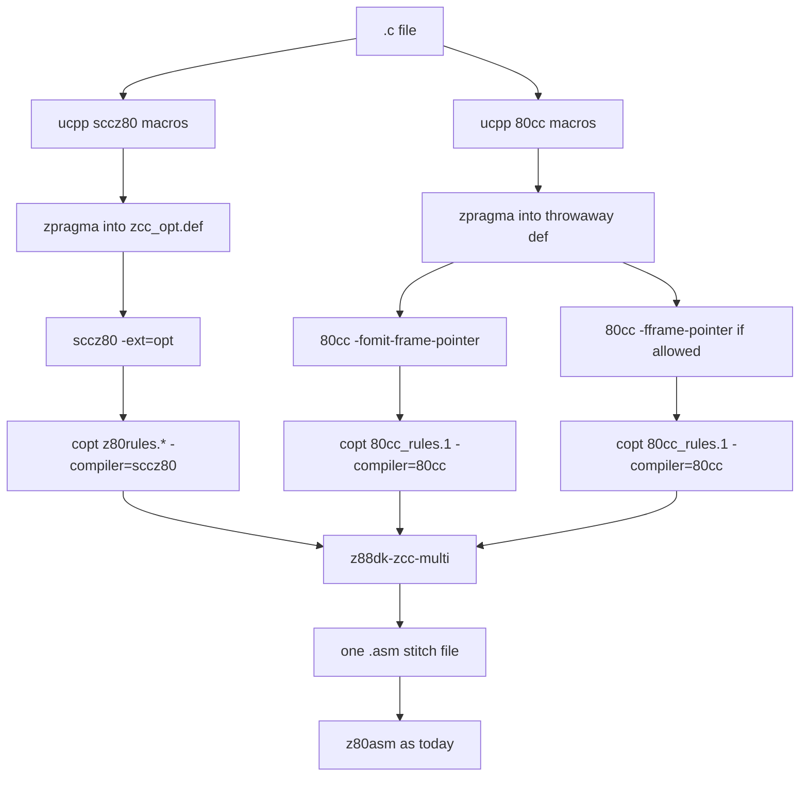

# zcc multi-compiler selection

| Field | Value |
|-------|-------|
| Title | zcc multi-compiler selection |
| Author | z88dk |
| Date | 2026-08-19 |
| Status | Draft |
| Type | Specification |

This document is a specification. Implementation comes later.

The key words MUST, MUST NOT, SHOULD, SHOULD NOT, and MAY have the meanings in RFC 2119.

## Overview

A C translation unit can have more than one compiler body for the same function.

`-compiler=multi` compiles the same `.c` file with sccz80 and with 80cc.

On Z80-family CPUs that have IX (z80, z80n, z180, ez80, Rabbit, kc160, and the ixiy/strict maps) there are three variants:

1. `sccz80` — sccz80 default. Locals use the stack. Multi does not pass `-frameix`.
2. `80cc-sp` — 80cc with `-fomit-frame-pointer`.
3. `80cc-fp` — 80cc with `-fframe-pointer` (IX frame).

On 8080, 8085, and gbz80 there are two variants only: `sccz80` and `80cc-sp`.

Those CPUs have no IX. 80cc already forces stack locals there.

Each variant runs through `z88dk-copt` with the matching rule set.

A new tool then selects the best body per function.

The metric is assembled size or a static T-state estimate.

The tool writes one assembly file.

`z88dk-z80asm` then assembles that file on the existing path.

The ABI is not fully the same for IX and IY.

The feature ships on the verified common subset.

The specification records the mismatches and the mixing rule.

## Background and motivation

zcc selects one compiler per run.

`src/zcc/zcc.c` stores the choice in `c_compiler_type` and `compiler_type`.

The known values are `CC_SCCZ80`, `CC_SDCC`, `CC_EZ80CLANG`, `CC_80CC`, and `CC_XCC`.

sccz80 and 80cc share the classic small-C calling convention.

They share the `l_*` runtime under `libsrc/l/sccz80/`.

They do not emit the same instruction stream.

A user who wants the smaller or cheaper body today must compile the file twice by hand.

That work does not mix functions from two compilers in one object.

`-compiler=multi` does that mix after copt.

The mix is per function.

The mix is not whole-program LTO.

## Goals and non-goals

### Goals

1. Add `-compiler=multi`.
2. Compile each `.c` file with three variants on Z80-family CPUs and two variants on 8080, 8085, and gbz80.
3. Run copt on each variant with the matching rules.
4. Select one body per function by size or by the v1 ticks metric.
5. Stitch one assembly file that z80asm already accepts.
6. Keep the existing assemble and link path after that file.

### Non-goals

1. zsdcc and ez80clang are not variants in v1.
2. Classic clib and newlib cores MUST NOT be mixed.
3. Library ABI MUST NOT change.
4. Multi MUST NOT rewrite hand-written `.asm`.
5. Multi MUST NOT run copt on hand-written library asm.
6. Multi does not do whole-program selection across translation units.
7. Multi does not add a per-function pragma in v1.
8. Multi does not run a full program in `z88dk-ticks` to score a function in v1.

## Key decisions

| Decision | Choice | Rationale |
|----------|--------|-----------|
| Switch | `-compiler=multi` | User requirement. Matches `-compiler=sccz80`. |
| Metric flags | `-compiler-multi-metric=size` (default) and `-compiler-multi-metric=ticks` | Same long-name style as `custom-copt-rules` in `src/zcc/zcc.c`. |
| Tool shape | New binary `z88dk-zcc-multi` | Parser and selector are not trivial. zcc already shells to copt and z80asm via `process()`. |
| Data source | sccz80 variant | Named objects must appear once. sccz80 is the default compiler. |
| Preprocess | Once per variant | Benches use `#ifdef __80CC`. One preprocess would drop that path. |
| zcc_opt.def | sccz80 zpragma output only | A second zpragma pass would duplicate pragmas. |
| Failure | Any variant compile or copt error fails the file | Silent fallback hides a broken compiler. |
| Ticks v1 | Static T-state sum from a z80asm listing | Deterministic. Cheap. Needs no workload. True dynamic ticks is a later PR. |
| Tie-break | Equal ticks then size. Equal size then variant priority | Stable output. |
| Variant priority | sccz80, then 80cc-sp, then 80cc-fp | sccz80 is the default compiler. 80cc-sp is the 80cc default. |
| sccz80 frame | Stack default only. Do not pass `-frameix` | sccz80 frame-pointer codegen is marked broken in `src/sccz80/codegen.c`. The three-way mix is sccz80 + 80cc-sp + 80cc-fp. |
| IX mix | Drop 80cc-fp for mbf32. Demote 80cc-fp if it would call a sccz80 body in the same file | 80cc treats IX as callee-saved. sccz80 default does not emit IX. mbf32 loads IX. |
| sdcc | Out of scope | sdcc uses a different calling convention. |
| Naked and interrupt | Selectable | They are ordinary labelled bodies after copt. |
| File-scope asm | Not selectable. Take from the data variant | It is not a C function. |

## CLI

### New switches

| Switch | Type | Default | Meaning |
|--------|------|---------|---------|
| `-compiler=multi` | existing `compiler` string | n/a | Enable multi mode. |
| `-compiler-multi-metric=size` | new string | `size` | Select the smaller assembled body. |
| `-compiler-multi-metric=ticks` | new string | | Select the lower static T-state sum. |
| `-compiler-multi-report=path` | new string | unset | Write a TSV report. |

Unknown metric values MUST be an error.

### Precedence

`option_parse()` in `src/common/option.c` writes `c_compiler_type` each time.

The last `-compiler=` on the command line wins.

If the last value is `multi`, multi mode is on.

If the last value is `sccz80`, `80cc`, `sdcc`, `xcc`, or `ez80clang`, multi mode is off.

A config `OPTIONS` line that sets `-compiler=sdcc` and a later user `-compiler=multi` therefore selects multi.

If multi is on and the clib recipe is an sdcc recipe (`sdcc_ix`, `sdcc_iy`), zcc MUST fail.

The error MUST say that `-compiler=multi` does not support the sdcc ABI.

### Frame-pointer flags

zcc has no native `-fframe-pointer` option.

Unknown leftover flags go to `add_option_to_compiler()` in `src/zcc/zcc.c`.

That is how `zcc -compiler=80cc -fframe-pointer` works today.

`-Cc` appends to `sccz80arg`.

Both sccz80 and 80cc consume `sccz80arg` in `configure_compiler()`.

Under `-compiler=multi` the driver owns the frame-pointer choice.

If the user passes `-fframe-pointer`, `-fomit-frame-pointer`, `-Cc-fframe-pointer`, or `-Cc-fomit-frame-pointer`, zcc MUST fail.

The error MUST say that multi selects those flags per variant.

`-Cc` other flags apply to both compilers.

If 80cc rejects a `-Cc` flag, the file fails.

Do not pass sccz80-only flags with multi.

### Scope of inputs

Multi applies only to `.c` inputs.

`.i` inputs follow the same compile path after preprocess.

`.asm`, `.s`, `.o`, and `.m4` pass through unchanged.

C++ is not supported. `configure_compiler()` already rejects C++ except for ez80clang.

### Lifecycle flags

| Flag | Behaviour under multi |
|------|------------------------|
| `-E` | Preprocess only. zcc SHOULD preprocess the sccz80 variant only. |
| `-a` / `-S` | Stop after the stitch file. Copy the stitch `.asm` as today. |
| `-c` | Stitch, then assemble to `.o` as today. |
| `-m` | Map of the final binary. Unchanged. |
| `-O` | Peephole level for each variant. Same `peepholeopt` for all. |
| `-Ca` | Assembler flags. Applied once to the stitch file. |
| `-Cl` | Linker flags. Unchanged. |
| `-v` | Print every tool command. Also print the selected variant per function. |
| `-vn` | Quiet. No winner lines. |
| `--math-mbf32` | Drop the 80cc-fp variant. See [Variant matrix](#variant-matrix). |

### Verbose lines

With `-v`, zcc MUST print one line per selectable function.

Example:

```text
zcc-multi: _foo selected=80cc-fp size=38 ticks=120 sccz80=42/130 80cc-sp=40/125 80cc-fp=38/120
```

The line MUST name the C symbol with the `_` prefix.

Missing variant columns MUST show `-`.

### Report file

`-compiler-multi-report=path` writes UTF-8 TSV.

The first line is a header.

```text
function	selected	reason	size_sccz80	size_80cc-sp	size_80cc-fp	ticks_sccz80	ticks_80cc-sp	ticks_80cc-fp
_foo	80cc-fp	metric	42	40	38	130	125	120
_bar	sccz80	ix-callee	20	18	16	80	70	60
```

`reason` is `metric`, `only`, `ix-callee`, or `fallback`.

The file MUST be parseable by `awk` and by a spreadsheet.

## Variant matrix

Use the existing `CPU_TYPE_*` tokens from `src/zcc/zcc.c`.

Do not invent a new CPU list.

80cc forces `c_framepointer_is_ix = -1` for `CPU_8080`, `CPU_8085`, and `CPU_GBZ80` in `src/80cc/main.c`.

Those CPUs have no IX. Multi MUST compile only the two stack variants there.

On every other `CPU_TYPE_*` in this tree, 80cc accepts `-fframe-pointer`.

sccz80 stays on its default stack frame on every CPU.

Multi MUST NOT pass `-frameix` or `-frameiy` to sccz80.

| `c_cpu` | Variants |
|---------|----------|
| `CPU_TYPE_8080` | sccz80, 80cc-sp |
| `CPU_TYPE_8085` | sccz80, 80cc-sp |
| `CPU_TYPE_GBZ80` | sccz80, 80cc-sp |
| `CPU_TYPE_Z80` | sccz80, 80cc-sp, 80cc-fp |
| `CPU_TYPE_Z80N` | sccz80, 80cc-sp, 80cc-fp |
| `CPU_TYPE_Z180` | sccz80, 80cc-sp, 80cc-fp |
| `CPU_TYPE_EZ80` | sccz80, 80cc-sp, 80cc-fp |
| `CPU_TYPE_R2KA` | sccz80, 80cc-sp, 80cc-fp |
| `CPU_TYPE_R3K` | sccz80, 80cc-sp, 80cc-fp |
| `CPU_TYPE_R4K` | sccz80, 80cc-sp, 80cc-fp |
| `CPU_TYPE_R6K` | sccz80, 80cc-sp, 80cc-fp |
| `CPU_TYPE_KC160` | sccz80, 80cc-sp, 80cc-fp |
| `CPU_TYPE_IXIY` | sccz80, 80cc-sp, 80cc-fp |
| `CPU_TYPE_STRICT` | sccz80, 80cc-sp, 80cc-fp |

Variant names in reports and comments MUST be `sccz80`, `80cc-sp`, and `80cc-fp`.

### Forced drop of 80cc-fp

Drop 80cc-fp when any of these hold.

1. The CPU is 8080, 8085, or gbz80.
2. The float mode is mbf32.
3. The user reserved IX.

mbf32 detection MUST treat these as mbf32.

- Alias `--math-mbf32` from `lib/config/alias.inc`
- `-Cc-fp-mode=mbf32`
- Preprocessor `__MATH_MBF32`

`--reserve-regs-ix` on the zcc line or in `-Cc` also drops 80cc-fp.

When 80cc-fp is dropped, the run is a two-variant run.

The report MUST leave the 80cc-fp columns empty.

### 80cc not present

If `c_80cc_exe` cannot run, zcc MUST fail.

There is no `80CCEXE` config key today.

v1 MUST add `80CCEXE` next to `SCCZ80EXE` in `src/zcc/zcc.c`.

v1 MUST add `ZCCMULTIEXE` for the new tool.

Default binaries are `z88dk-80cc` and `z88dk-zcc-multi`.

## Pipeline



### Preprocess

Each variant MUST run ucpp with its own macros.

sccz80 macros match `configure_compiler()` today:

```text
-DSCCZ80 -DSMALL_C -D__SCCZ80
```

80cc macros match `configure_compiler()` today:

```text
-DSCCZ80 -DSMALL_C -D__SCCZ80 -D__80CC
```

Both variants also get `-D__Z88DK` and the target defines.

This is required.

`support/benchmarks/*/z88dk-classic/*.c` uses `#ifdef __80CC` for TIMER labels.

One shared `.i` would drop those labels on the 80cc path.

### zpragma and zcc_opt.def

zcc now writes `zcc_opt.def` under a unique `/tmp/tmpzccXXXXXXXX` directory.

See `src/zcc/zcc.c` around the `mkdtemp` call.

A second zpragma pass on the same file would duplicate `defc` lines.

The sccz80 zpragma pass MUST write the link-time `zcc_opt.def`.

Each 80cc zpragma pass MUST write a throwaway file.

CRT m4 MUST read the sccz80 `zcc_opt.def` only.

### Compile

Each variant compiles `.i` to `.opt` with `-ext=opt` and `-zcc-opt=` as today.

sccz80 command extra flags come from `sccz80arg` except frame-pointer flags.

80cc-sp MUST pass `-fomit-frame-pointer`.

80cc-fp MUST pass `-fframe-pointer`.

80cc already defaults to omit.

The explicit flag records the intent.

Do not copy the existing typo `BuildOptions(&linkargs, "-D__80")` from the 80cc branch.

The asm and link defines for 80cc remain `-D__SCCZ80` and `-D__80CC`.

Under multi the stitch file is not compiler-specific.

The link defines SHOULD be `-D__SCCZ80 -D__80CC -D__COMPILER_MULTI`.

### copt

Each variant MUST run `apply_copt_rules()` with the matching set.

sccz80 uses `c_coptrules9` plus the `-O` set from `z80rules.2`, `z80rules.1`, and `z80rules.0`.

sccz80 also uses `COPTRULESTARGET`, CPU rules, `COPTRULESINLINE` when set, and user rules.

80cc uses `c_coptrules9` plus `c_80cc_opt` (`lib/80cc_rules.1`).

80cc also uses target, CPU, and user rules.

copt MUST receive `-compiler=sccz80` or `-compiler=80cc`.

`src/copt/copt.c` uses that value for `%compiler` and `%notcompiler`.

Hand-written library asm MUST NOT go through this path.

### Temp names

zcc already allocates one `temporary_filenames[i]` per input via `tempname()`.

Variant files MUST use extra suffixes on that base.

| Stage | sccz80 | 80cc-sp | 80cc-fp |
|-------|--------|---------|---------|
| ucpp | `.sccz80.i2` | `.80cc.i2` | reuse `.80cc.i2` |
| zpragma | `.sccz80.i` | `.80cc-sp.i` | `.80cc-fp.i` |
| compile | `.sccz80.opt` | `.80cc-sp.opt` | `.80cc-fp.opt` |
| copt ping-pong | `.sccz80.op1` | `.80cc-sp.op1` | `.80cc-fp.op1` |
| post-copt | `.sccz80.asm` | `.80cc-sp.asm` | `.80cc-fp.asm` |
| stitch | `.asm` | | |

80cc-sp and 80cc-fp MAY share the ucpp output.

They MUST NOT share the compiler output.

The stitch file uses the existing `.asm` name so the later `CASE_ASMFILE` path is unchanged.

Two zcc processes in one cwd already use `/tmp` names.

They still MUST NOT share a cwd `zcc_opt.def` if an old client writes one.

Multi does not make that race worse.

### Failure policy

If ucpp, zpragma, the compiler, or copt fails for any required variant, zcc MUST fail the file.

zcc MUST NOT drop that variant and continue.

A missing optional 80cc-fp (mbf32 or no IX) is not a failure.

If a function label is absent from every variant, the tool MUST fail.

If a function is absent from one variant, the tool MUST use the variants that have it.

`reason` is then `only` or `fallback`.

80cc may skip or inline a body that sccz80 emits.

That case is expected.

## Function identity

### Recognition

After copt both compilers emit a function like this.

```asm
; Function foo flags 0x00000200 __smallc
; int foo(int a)
; parameter 'int a' at sp+2 size(2)
	C_LINE	10,"foo.c::foo::0::0"
._foo
	ld	hl,2
	add	hl,sp
	...
	ret
```

A selectable function starts at a file-scope code label.

Accepted label forms:

| Form | Source |
|------|--------|
| `._name` | Default C function. `prefix()` writes `.`. `Z80ASM_PREFIX` is `_`. |
| `.name` | `dopref() == NO`. Rare asm name. |
| `name:` | Colon form if copt or a user insert adds it. |

`GLOBAL _name` at the end of the file is a declaration.

It is not a function start.

80cc IR also emits `L_fN_bb_M:` inside the body.

Those labels belong to the enclosing function.

sccz80 emits `i_N` for local labels and for the file literal pool.

### Extent

The function body starts at the function label.

The body ends at the next file-scope function label.

The body also ends at a file-scope data label `._var` in `bss_compiler` or `data_compiler`.

The body also ends at `; --- Start of Optimiser additions ---`.

The body also ends at `; --- Start of Static Variables ---`.

The body also ends at `; --- Start of Scope Defns ---`.

The body also ends at end of file.

Nested labels stay in the function.

`SECTION` lines inside the body stay in the function.

A switch table that sits under local labels after `ret` stays in the function if no new file-scope function started.

### Not selectable

These items are not functions.

1. File-scope data, bss, and rodata objects with a stable C name.
2. The shared literal pool `.i_1` / `i_N` dump after the optimiser banner.
3. `MODULE`, `INCLUDE`, and file-level `GLOBAL` / `EXTERN` lists.
4. Banner comments and include `C_LINE` lines before the first function.
5. Whole-file `__asm` blobs that are not a C function.

### Special functions

| Kind | Rule |
|------|------|
| `static` | Selectable. The label is still `._name`. |
| `naked` | Selectable. |
| `interrupt` | Selectable. |
| `__critical` | Selectable. |
| `__z88dk_callee` / `__z88dk_fastcall` | Selectable. ABI is shared. |
| `__banked` | Selectable. Both compilers emit `banked_call`. |
| File-scope asm | Not selectable. Copy from the data variant. |

## Size metric

Size is the assembled byte count of the function unit.

Size is not the source line count.

### How to measure

`z88dk-zcc-multi` MUST assemble each variant file with `z88dk-z80asm`.

The CPU flag MUST match the compile CPU.

Example:

```text
z88dk-z80asm -mz80 -l -I"<z88dk>/lib" -o <tmp.o> <variant.asm>
```

The tool MUST parse the `.lis` file.

The size of a function is the sum of opcode bytes from the function label to the end of the function unit.

`INCLUDE "z80_crt0.hdr"` contributes no function bytes.

`SECTION` padding outside the function MUST be excluded.

`defb` / `defw` / `defm` that belong to the function unit MUST be included.

A `call l_mult` counts the `call` encoding only.

Relocatable operands count at their assembled width.

JR versus JP differences appear in the listing.

That is required.

If z80asm fails on a variant file, the tool MUST fail.

A post-copt file that does not assemble is a file failure.

## Ticks metric

v1 MUST NOT run the function in `z88dk-ticks`.

A function is not a program.

Arguments, globals, and helpers are not available.

TIMER labels are not present in arbitrary code.

### v1 definition

The ticks score is a static T-state sum.

The tool walks the same listing used for size.

Each instruction adds the T-state cost for the selected CPU.

The cost tables MUST match `z88dk-ticks`.

The source of the numbers is `src/ticks/ticks.c` and the per-CPU files.

Examples are `src/ticks/zilog_inst.c` and `src/ticks/i8085_inst.c`.

The CPU model MUST match the zcc `-m` / `c_cpu` value.

The ticks `-m` flag MUST stand before any binary path if a later PR runs ticks.

v1 does not run that binary.

### Branch policy

| Instruction | Cost in the sum |
|-------------|-----------------|
| Straight-line op | Documented T-states |
| Forward `jr cc` / `jp cc` | Not-taken cost |
| Backward `jr cc` / `jp cc` / `djnz` | Taken cost, once |
| Unconditional `jr` / `jp` | Always-taken cost |
| `call` / `rst` to a helper or a C function | Cost of the call instruction only |
| `ret` / `ret cc` | Unconditional `ret` cost, or not-taken for a forward-style `ret cc` |
| `halt` / illegal | Fail the ticks score for that function |

Each instruction in the listing is counted once.

Loops are not unrolled.

The score is not a workload measurement.

It is a deterministic compile-time proxy.

### What the score is not

The score undercounts a hot loop.

The score overcounts a rare error path.

A user who needs true TIMER numbers MUST still run `z88dk-ticks` on the linked program.

See `.agents/skills/tool-ticks/SKILL.md` and `.agents/skills/methodology-measure/SKILL.md`.

### Fallback

If the listing has `jp (hl)`, `jp (ix)`, `jp (iy)`, or an unknown opcode, the tool MUST NOT use ticks for that function.

It MUST fall back to size for that function only.

`reason` is `fallback`.

### Tie-break

1. Lower ticks wins when the metric is `ticks`.
2. If ticks are equal, lower size wins.
3. If size is equal, variant priority wins.

Priority order is:

1. `sccz80`
2. `80cc-sp`
3. `80cc-fp`

When the metric is `size`, skip step 1.

## Stitch

The stitch file MUST be valid input for `z88dk-z80asm`.

### File layout

1. A banner comment that names `-compiler=multi` and the metric.
2. `MODULE` from the data variant.
3. `INCLUDE "z80_crt0.hdr"`.
4. File-level `C_LINE` include trace from the data variant. Optional.
5. Selected function units, each with a winner comment.
6. File-scope data, bss, and named rodata from the data variant.
7. Literal pools from every variant that contributed a function.
8. `GLOBAL` and `EXTERN` union.

### Winner comment

```asm
; zcc-multi: _foo selected=80cc-fp size=38 ticks=120
._foo
	...
```

### Data objects

Named file-scope objects MUST come from the sccz80 variant only.

The tool MUST compare the set of named objects across variants.

Compare names and assembled sizes.

If a name exists in one variant and not another, the tool MUST fail.

If sizes differ, the tool MUST fail.

`#ifdef __80CC` that changes a global layout makes the file invalid for multi.

Unnamed literal pools MAY differ.

Each contributing variant keeps its own pool under rewritten labels.

### Local label rewrite

`i_1` is reused in every variant.

`L_f1_bb_0` is reused in every 80cc function index.

The stitch pass MUST rewrite local labels so they are unique in the file.

| Original | Rewrite |
|----------|---------|
| `i_N` | `i_<variant>_N` |
| `L_fA_bb_B` | `L_<variant>_fA_bb_B` |

References in operands MUST change with the definitions.

File-scope names `_foo` and `_var` MUST NOT be rewritten.

### Sections

Preserve `SECTION` directives from the selected text.

Code MUST stay in `code_compiler` unless the compile used `--codeseg`.

Data MUST stay in the same section as the data variant.

A single-compiler build and a multi build of the same sccz80-only file MUST place objects in the same sections.

### PUBLIC / GLOBAL / EXTERN

Both compilers emit `GLOBAL` at the end of the file.

See `GlobalPrefix()` in `src/sccz80/codegen.c`.

The stitch file MUST emit the union of `GLOBAL` names that remain.

The stitch file MUST emit `EXTERN` for helpers that any selected body calls.

Do not emit `GLOBAL` for a discarded function body.

### Debug / C_LINE

Keep `C_LINE` from the selected variant.

Drop `C_LINE` from discarded bodies.

`-debug` / `-debug-defc` MAY produce `__CDBINFO__` symbols.

Those symbols MUST come from the selected body only.

If two variants emit the same `__CDBINFO__` name, keep the selected body.

### Discarded bodies

Do not keep losing-variant function bodies.

## Tool shape

### Name

Binary: `z88dk-zcc-multi`

Source: `src/zccmulti/`

zcc invokes it the same way it invokes `z88dk-copt`.

See `process()` and `apply_copt_rules()` in `src/zcc/zcc.c`.

### argv

```text
z88dk-zcc-multi
    --cpu=<cpu>
    --metric=size|ticks
    --data-variant=sccz80
    --variant=<name>:<path.asm>
    --output=<path.asm>
    [--report=<path.tsv>]
    [--verbose]
    [--z80asm=<path>]
    [--asm-include=<dir>]
    [--list-dir=<dir>]
```

`--variant` MAY repeat.

`--cpu` uses the z80asm token: `z80`, `z80n`, `z180`, `8080`, `8085`, `gbz80`, `ez80_z80`, `r2ka`, `r3k`, `r4k`, `r6k`, `kc160`.

`--z80asm` defaults to `z88dk-z80asm`.

### Exit codes

| Code | Meaning |
|------|---------|
| 0 | Stitch file written |
| 1 | Parse, select, or metric error |
| 2 | I/O or assembler invocation error |

stderr MUST state the failing function or file.

stdout is silent unless `--verbose`.

### Config

Add to the zcc config table in `src/zcc/zcc.c`:

```text
80CCEXE        Name of 80cc binary          default z88dk-80cc
ZCCMULTIEXE    Name of the multi tool       default z88dk-zcc-multi
```

`80CCRULES` already exists and points at `DESTDIR/lib/80cc_rules.1`.

## ABI compatibility

The claim that sccz80 and 80cc have a consistent ABI is only partly true.

They share the classic small-C convention between functions.

They do not share a full IX and IY callee-save contract.

The feature ships on the verified common subset below.

### 1. Default argument order

Both compilers default to left-to-right small-C.

sccz80 sets `SMALLC` when `c_use_r2l_calling_convention == NO`.

See `parse_trailing_modifiers()` in `src/sccz80/declparse.c`.

The same test exists in `src/80cc/declparse.c`.

Both default `c_use_r2l_calling_convention` to `NO`.

`-set-r2l-by-default` on zcc sets `c_sccz80_r2l_calling`.

`configure_compiler()` then passes `-set-r2l-by-default` to both compilers.

Stack layout for small-C:

- Caller pushes arguments left to right.
- The rightmost argument sits at the lowest address.
- Default `params-offset` is 2.
- That 2 is the return address.

See `-params-offset` in `src/sccz80/main.c` and `src/80cc/main.c`.

Both default `c_params_offset = 2`.

STDC / `__stdc` pushes right to left.

Both compilers implement that when `SMALLC` is clear.

`__z88dk_sdccdecl` packs stacked chars as one byte.

Both front ends accept that flag.

**Verdict:** argument order matches on the shared flags.

### 2. Return values

| Type | Register or home | Evidence |
|------|------------------|----------|
| 8-bit int / char | L, often widened in HL | 80cc `ir_lower_call.inc.c` stores a byte from L |
| 16-bit int / pointer | HL | Both. 80cc comment "Return value in HL (width ≤ 2)" |
| 32-bit int / 32-bit float | DEHL. HL is low. DE is high | sccz80 `lpush()` is `push de` then `push hl`. 80cc matches that comment |
| 48-bit classic double | FA memory accumulator | sccz80 `gen_leave_function()` maps `KIND_DOUBLE` with `c_fp_size > 4` to `KIND_NONE` |
| IEEE / math32 32-bit float | DEHL as a long | `c_fp_size == 4` maps to `KIND_LONG` in `gen_leave_function()` |
| math16 | HL as a 16-bit value | `KIND_FLOAT16` maps to `KIND_INT` |
| long long | `__i64_acc` | Both push `ld bc,__i64_acc` before some calls |
| struct argument | Copied onto the stack with `ldir` | `gen_push_function_argument()` in sccz80 |
| struct return | Same front-end rules. Both trees share the declparse shape | Forked from sccz80 |

**Verdict:** integer, pointer, and the mapped float modes match.

Classic 48-bit float is not in HL.

Callers use `d*` helpers.

Both compilers call those helpers by the same mapped names.

See the `dcallrts` table in `src/sccz80/codegen.c`.

80cc uses `acc_prim()` for `dload` / `dstore` / `dpush`.

### 3. `__z88dk_fastcall`

The last parameter arrives in registers.

It is not on the caller stack.

| Width | Registers |
|-------|-----------|
| 1 or 2 bytes | HL |
| 4 bytes | DEHL |
| classic float / long long | FA / `__i64_acc` |

80cc states this in `src/80cc/ir_alloc.c`:

```c
/* The __z88dk_fastcall arg (the last param) arrives in HL, NOT on the
   caller stack */
```

sccz80 stores the last fastcall argument after entry.

See `declparse.c` around the `FASTCALL` push of HL / DEHL.

sccz80 warns that sdcc only supports a single fastcall parameter.

Both compilers still accept multi-arg fastcall.

Earlier arguments stay on the stack.

The last argument is the register one.

**Verdict:** fastcall matches.

### 4. `__z88dk_callee`

The callee pops the stack arguments.

sccz80 `gen_leave_function()` tests `CALLEE` and `stackargs > 2`.

80cc `ir_lower_call.inc.c` says "CALLEE cleans the stack after ret instead of us."

The caller MUST NOT pop callee arguments.

**Verdict:** callee matches.

### 5. Callee-saved registers, especially IX and IY

This is the mixing hazard.

#### 80cc

ADR 0011 states that IX and IY are callee-saved.

`src/80cc/ir_alloc.c` says every 80cc-compiled function preserves them.

`func_call_clobbers()` returns 0.

The comment says the callable library is IX/IY-safe.

`frame_has_saved_fp()` pushes IX in fp mode.

`frame_has_saved_ix()` pushes IX in sp mode when the function uses IX.

`frame_has_saved_iy()` pushes IY when idx3 residency is on.

80cc-fp keeps the frame pointer in IX across calls.

#### sccz80

Default `c_framepointer_is_ix` is `-1`.

See `src/sccz80/main.c`.

sccz80 does not emit IX in default codegen.

The only IX writes are behind `-frameix` / `SAVEFRAME`.

`codegen.c` says "FRAME POINTER STUFF IS BROKEN - DO NOT USE!!!".

sccz80 does not promise to preserve IX.

It also does not use IX as scratch in the C body.

A sccz80 function can still call a helper that loads IX.

#### mbf32

`libsrc/math/float/mbf32/c/sccz80/l_f32_add.asm` does `ld ix, ___mbf32_FPADD`.

The 80cc skill says: do not use `-fframe-pointer` with `--math-mbf32`.

Bench readmes repeat that line.

#### Classic integer helpers

80cc helper lowering treats many `l_*` names as index-safe.

See `helper_preserves_index_alt()` in `src/80cc/ir_lower.c`.

Unknown, long, float, i64, and far helpers are conservative.

#### Mixing rule

The compilers disagree on IX as a live-across-call register.

v1 MUST apply this rule.

1. Drop 80cc-fp when mbf32 is on.
2. Select bodies by metric first.
3. Walk intra-file direct calls.
4. If a selected 80cc-fp body calls a selected sccz80 body, demote the 80cc-fp body.
5. Repeat until stable.

Demote means: take the next-best variant for the caller.

`reason` is `ix-callee`.

80cc-sp may still mix with sccz80.

80cc-sp saves IX when it uses IX.

A sccz80 caller does not keep a live frame in IX.

Library calls keep the 80cc assumption.

Integer `l_*` helpers are treated as IX-safe.

mbf32 is not.

**Verdict:** not fully consistent.

The common subset is the stack ABI plus this IX rule.

### 6. Register clobber sets on a normal `call`

| Register | After a normal C `call` |
|----------|-------------------------|
| AF, BC, DE, HL | Caller-saved. Clobbered. |
| IX | 80cc: callee-saved. sccz80 default: unused, not guaranteed. |
| IY | 80cc: callee-saved. Some float libs clobber IY. |
| Alternate set | sccz80 may use it unless `-noaltreg`. 80cc uses it only with experimental `--exx`. |

80cc saves BC around a call when a value is homed in BC.

That is a caller convention inside the 80cc body.

It does not change the callee ABI.

**Verdict:** AF/BC/DE/HL match.

IX and IY do not fully match.

### 7. sdcc

sdcc is out of scope.

zsdcc default recipes use `__sdcccall(1)` and a different register plan.

`include/sys/compiler.h` defines `__Z88DK_R2L_CALLING_CONVENTION` for sdcc.

sccz80 and 80cc default to small-C left-to-right.

80cc can lower `__sdcccall(1)` for some shapes.

That path is not the multi ABI.

A file compiled with `-compiler=multi` MUST use the classic convention.

### 8. File-scope data

Each compile emits `_var` again.

The stitch layer MUST take named data from the sccz80 variant only.

See [Stitch](#stitch).

### 9. Static functions, local labels, sections, C_LINE

Static functions use `._name` and are selectable.

Local labels MUST be rewritten.

`SECTION` MUST be preserved.

`C_LINE` comes from the selected body.

### 10. Library and helper calls

Both compilers call the classic runtime.

Examples:

- `l_mult`, `l_div`, `l_div_u`
- `l_gint`, `l_glong`
- `l_f32_*` under `--math32`
- `dadd` / `dload` under classic 48-bit float

80cc `ir_build.c` emits `l_mult` and `l_div` for integer multiply and divide.

sccz80 `callrts()` uses the same names.

A function that calls a helper with a different convention MUST not be mixed.

v1 treats same-named `l_*` / `d*` helpers as the same convention.

If a later audit finds a helper that 80cc and sccz80 call differently, that helper name MUST be refused.

The tool SHOULD emit a warning when a selected body calls a helper from a known IX-unsafe set.

The v1 unsafe set is the mbf32 entry points.

Those already drop 80cc-fp.

## ABI common subset

A function is in the common subset when all of these hold.

1. It uses small-C, STDC, fastcall, or callee as both compilers implement them.
2. It returns a type from the table above.
3. It does not require sdcc register ABI.
4. If it is 80cc-fp, it does not call a sccz80 body in the same file.
5. Named data is identical across variants.

v1 MAY select any function that both compilers emit under those rules.

## Interaction with 80cc internal fp-to-sp flip

80cc may flip a function from fp to sp inside an fp compile.

See `ir_lower_func_flip()` in `src/80cc/ir_lower.c`.

That flip is internal to the 80cc-fp variant.

The stitch layer MUST treat the result as `80cc-fp` still.

Do not add a fourth variant for the flip.

## Observability

1. `-v` winner lines from zcc.
2. Optional TSV report.
3. `; zcc-multi:` comments in the stitch file.
4. `-a` lets a user read the stitch file.
5. `-m` map still names `_foo` once.

A user proves the selected compiler by reading the comment or the report.

The map cannot name the compiler.

## Risks

| Risk | Severity | Mitigation |
|------|----------|------------|
| IX live in 80cc-fp, clobbered by a sccz80 callee or mbf32 | High | Drop 80cc-fp for mbf32. Demote 80cc-fp that calls a sccz80 body |
| Duplicate `_var` | High | Data from sccz80 only. Fail on set or size mismatch |
| `i_1` collision | High | Rewrite local labels |
| Different inlining, missing labels | Medium | Use variants that have the function. Fail if none have it |
| `#ifdef __80CC` changes data | Medium | Compare named objects. Fail the file |
| Compile-time cost of N compiles and N copts | Medium | Opt-in switch. Share 80cc ucpp output |
| mbf32 / IX | High | Drop 80cc-fp |
| Parallel zcc and `zcc_opt.def` | Low for current zcc | Def file is already under `/tmp/tmpzcc*`. Variants share one process |
| 80cc internal flip hides as fp | Low | Still labelled 80cc-fp. Metric sees the real bytes |
| Static ticks is not TIMER | Medium | Document it. Later PR for dynamic ticks |
| `-Cc` flag rejected by 80cc | Low | Fail the file. Do not filter in silence |
| `CPU_TYPE_IXIY` swaps IX at assemble | Low | 80cc-fp still emits IX. Assembler swaps both sides |

## Alternatives considered

### Whole-file pick versus per-function stitch

Whole-file pick would compile N times and keep one file.

It is simpler.

It cannot mix a small 80cc leaf with a small sccz80 caller.

The user asked for per-function stitch.

v1 uses per-function stitch.

### User pragma versus automatic metric

A pragma would let a user force `_foo` to 80cc-fp.

It is clear.

It is not automatic.

v1 uses the metric.

A pragma MAY appear in a later PR.

### Object stitch versus assembly stitch

Object stitch would assemble each variant and then copy sections.

z80asm objects can hold one module.

Local labels would already be isolated.

Helper EXTERNs would be cleaner.

The user asked for post-copt assembly stitch.

v1 stitches assembly.

A later PR MAY move the metric onto object listings only.

The stitch output stays assembly so `-a` remains useful.

## Tests

Add `test/suites/zcc-multi/`.

Follow `test/suites/sccz80/Makefile`.

### Required cases

1. A small C file with two functions that differ between the compilers.
2. Assert the stitch file contains exactly one `._foo` and one `._bar`.
3. Assert each named data label appears once.
4. Construct a fixture where 80cc-sp is smaller than sccz80 for `_foo`.
5. Assert `-compiler-multi-metric=size` selects that smaller body.
6. CPU matrix: z80 (3 variants: sccz80, 80cc-sp, 80cc-fp), 8085 (2: sccz80, 80cc-sp), gbz80 (2), 8080 (2).
7. A compiler error in one variant fails the file.
8. `-v` prints a selected line for each function.
9. `--math-mbf32` on z80 does not run 80cc-fp.
10. A 80cc-fp function that calls a sccz80-selected callee is demoted.
11. `.asm` input is not rewritten.
12. `-a` writes one `.asm` and stops.

### Fixture sketch

```c
int foo(int a, int b)
{
    return a + b + a + b;
}

int bar(int n)
{
    int s = 0;
    int i;
    for (i = 0; i < n; ++i)
        s += i;
    return s;
}

int g;
```

The test driver runs zcc with `-a -compiler=multi -compiler-multi-report=out.tsv`.

It greps the stitch file and the TSV.

## Rollout

The feature is off by default.

Only `-compiler=multi` enables it.

Existing `-compiler=sccz80` and `-compiler=80cc` MUST not change.

Do not write wiki pages until the tool exists.

This specification is the first artefact.

## Open questions

1. Should a later version add `-compiler-multi-pragma` to force a function to one variant?

v1 does not need that switch.

The metric and the IX rule are enough to implement.

## References

- `src/zcc/zcc.c`, `src/zcc/zcc.h`
- `src/common/option.c`
- `src/sccz80/declparse.c`, `src/sccz80/callfunc.c`, `src/sccz80/codegen.c`, `src/sccz80/main.c`
- `src/80cc/main.c`, `src/80cc/declparse.c`, `src/80cc/ir_alloc.c`, `src/80cc/ir_lower.c`, `src/80cc/ir_lower_call.inc.c`
- `src/80cc/adr/0002-z80-register-model.md`
- `src/80cc/adr/0011-index-register-allocation.md`
- `src/80cc/adr/0012-frame-pointer-default-by-cpu.md`
- `lib/80cc_rules.1`, `lib/z80rules.*`
- `lib/config/alias.inc`
- `libsrc/math/float/mbf32/c/sccz80/l_f32_add.asm`
- `include/sys/compiler.h`
- `.agents/skills/compiler-sccz80/SKILL.md`
- `.agents/skills/compiler-80cc/SKILL.md`
- `.agents/skills/tool-zcc/SKILL.md`
- `.agents/skills/tool-copt/SKILL.md`
- `.agents/skills/tool-ticks/SKILL.md`
- `.agents/skills/methodology-measure/SKILL.md`

## PR plan

### PR 1 — Specification only

- **Title:** spec: zcc multi-compiler selection
- **Files:** `zcc-compiler-multi.md`
- **Depends on:** none
- **Changes:** Land this document. No code.

### PR 2 — `z88dk-zcc-multi` parse skeleton

- **Title:** tools: add z88dk-zcc-multi assembly parser
- **Files:** `src/zccmulti/*`, `src/zccmulti/Makefile`, top-level tool build hook
- **Depends on:** PR 1
- **Changes:** Parse post-copt asm. List functions, data labels, and sections. No select yet. Add a small host test on checked-in fixtures from `src/80cc/fw_full.asm` shape.

### PR 3 — Size metric via z80asm listing

- **Title:** tools: z88dk-zcc-multi size metric
- **Files:** `src/zccmulti/*`
- **Depends on:** PR 2
- **Changes:** Invoke z80asm with `-l`. Count opcode bytes per function. Fail if assemble fails.

### PR 4 — Stitch writer

- **Title:** tools: z88dk-zcc-multi stitch by size
- **Files:** `src/zccmulti/*`
- **Depends on:** PR 3
- **Changes:** Rewrite local labels. Copy named data from `--data-variant`. Emit winner comments. Write one `.asm`. Host tests for one `_foo` / one `_bar` and single data.

### PR 5 — zcc `-compiler=multi` driver

- **Title:** zcc: add -compiler=multi
- **Files:** `src/zcc/zcc.c`, `src/zcc/zcc.h`, config keys `80CCEXE` and `ZCCMULTIEXE`
- **Depends on:** PR 4
- **Changes:** Parse `-compiler=multi` and the metric / report flags. Build the variant matrix. Reject frame-pointer leftovers. Run per-variant ucpp, zpragma, compile, and copt. Invoke `z88dk-zcc-multi`. Leave assemble and link unchanged. Print `-v` winner lines.

### PR 6 — IX demote and mbf32 drop

- **Title:** zcc-multi: drop 80cc-fp for mbf32 and demote IX-unsafe callers
- **Files:** `src/zcc/zcc.c`, `src/zccmulti/*`
- **Depends on:** PR 5
- **Changes:** Implement the mbf32 and reserve-IX drops. Walk intra-file calls. Demote 80cc-fp callers of sccz80 bodies.

### PR 7 — Acceptance suite

- **Title:** test: zcc-multi size path
- **Files:** `test/suites/zcc-multi/*`
- **Depends on:** PR 5 and PR 6
- **Changes:** Add the required cases. Cover z80, 8085, gbz80, and 8080. Fail-on-variant-error. Report and `-v` checks.

### PR 8 — Static ticks metric

- **Title:** tools: z88dk-zcc-multi static ticks metric
- **Files:** `src/zccmulti/*`, shared timing tables or a thin include from `src/ticks/`
- **Depends on:** PR 3
- **Changes:** Implement the v1 T-state sum. Map `c_cpu` to the ticks model. Fall back to size on computed jumps. Tie-break as specified. Extend the suite with `-compiler-multi-metric=ticks`.

PR 8 MAY land after PR 7.

Size is the default metric.

PR 7 MUST not wait on ticks.

### PR 9 — Optional dynamic ticks (later)

- **Title:** tools: optional dynamic ticks harness for zcc-multi
- **Files:** `src/zccmulti/*`
- **Depends on:** PR 8
- **Changes:** Only if a later review wants true `z88dk-ticks` scores. Out of v1.

### PR 10 — Wiki after the tool exists

- **Title:** wiki: document -compiler=multi
- **Files:** wiki tool page for zcc
- **Depends on:** PR 7
- **Changes:** Human documentation. Not before the binary exists.
